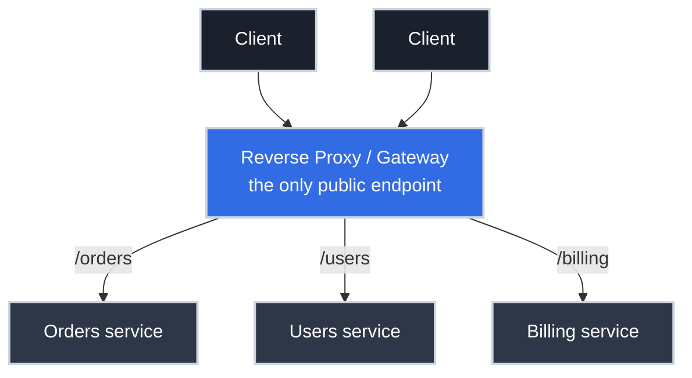

# Reverse Proxies and API Gateways, Demystified

You've now [exposed an endpoint](../../http/essentials/from_url_to_endpoint.md) and [secured it with HTTPS](../../tls/essentials/https_for_apis.md). But in production, clients almost never connect to your application directly. There's a piece of infrastructure standing in front of it — the thing that actually owns the public address, terminates TLS, and decides which requests even reach your code. When someone says "the endpoint is behind the gateway," *this* is what they mean, and not understanding it leaves a permanent gap in the picture of how an API is exposed and secured.

This article demystifies that front door: the reverse proxy and its more capable cousin, the API gateway.

## The Core Idea: A Front Door for Your Services

A **reverse proxy** is a server that sits between clients and your backend services. Clients talk to *it*; it talks to your services on their behalf and relays the responses back. From the client's perspective, the proxy *is* the API — the real servers are invisible.



This flips the exposure model from the [direct-binding picture](../../http/essentials/from_url_to_endpoint.md): your services bind to a *private* address, unreachable from the internet, and only the proxy is bound to the public port. The proxy becomes your single, defensible front door — which is exactly why production systems are built this way.

!!! tip "Forward proxy vs reverse proxy"

    A *forward* proxy sits in front of **clients** and hides them from servers (corporate web filters, VPNs). A *reverse* proxy sits in front of **servers** and hides them from clients. Same idea, opposite direction — and APIs are about reverse proxies.

## What the Front Door Does For You

Putting a proxy in front lets you handle cross-cutting concerns *once*, at the edge, instead of reimplementing them in every service.

<div class="grid cards" markdown>

-   :material-lock: __TLS Termination__

    ---

    **Why it matters:** one certificate at the edge instead of one per service.

    The proxy [terminates TLS](../../tls/essentials/https_for_apis.md), so backends don't each manage certs. The most common reason a front door exists.

-   :material-sign-direction: __Routing__

    ---

    **Why it matters:** many services behind one address.

    `/orders` goes to the orders service, `/users` to users — path- or host-based rules map one public endpoint onto many private ones.

-   :material-scale-balance: __Load Balancing__

    ---

    **Why it matters:** spread traffic, survive a dead instance.

    The proxy distributes requests across healthy backends and stops sending to ones that fail health checks.

-   :material-shield-account: __Auth & Rate Limiting__

    ---

    **Why it matters:** reject bad traffic before it costs you.

    Validate tokens and enforce quotas at the edge so invalid or abusive requests never reach your code.

</div>

## Reverse Proxy vs API Gateway: Where's the Line?

These terms overlap, and people use them loosely. The useful distinction is *how much application-awareness* the front door has.

| | Reverse Proxy | API Gateway |
| :--- | :--- | :--- |
| **Primary job** | Relay and balance traffic | Manage APIs as products |
| **Operates on** | Connections, hosts, paths | Requests, routes, identities, quotas |
| **Typical features** | TLS, routing, load balancing, caching | All that **plus** auth, rate limiting, API keys, request/response transformation, usage analytics |
| **Examples** | NGINX, HAProxy, Envoy | Kong, AWS API Gateway, Apigee, Envoy + control plane |

The short version: **an API gateway is a reverse proxy that understands your API**. A plain reverse proxy moves bytes to the right backend. A gateway additionally knows what a "request," a "consumer," and a "rate limit" are, and enforces policy on them. Many tools (Envoy especially) can be either, depending on configuration.

You reach for a gateway specifically when you want to centralize *API-level policy* — authentication, per-consumer quotas, key management — rather than bake it into every service.

## A Minimal Reverse Proxy Config

Concretely, here's NGINX terminating TLS and routing two paths to two private backends:

```nginx title="NGINX as a routing, TLS-terminating front door" linenums="1"
server {
    listen 443 ssl;                       # (1)!
    server_name api.example.com;
    ssl_certificate     /etc/ssl/api.crt; # (2)!
    ssl_certificate_key /etc/ssl/api.key;

    location /orders/ {                    # (3)!
        proxy_pass http://10.0.1.10:8080; # (4)!
        proxy_set_header X-Forwarded-Proto https;  # (5)!
    }
    location /users/ {
        proxy_pass http://10.0.1.11:8080;
    }
}
```

1. The proxy — not the app — binds the public port 443 and speaks TLS.
2. The certificate lives here, at the termination point.
3. Path-based routing: requests under `/orders/` match this block.
4. Forwarded to a **private** IP/port the internet can't reach directly.
5. Tells the backend the original request was HTTPS, preventing the [redirect loop](../../tls/essentials/https_for_apis.md) that bites first-time proxy setups.

A gateway config layers policy on top of this — `auth` plugins, `rate-limiting` plugins, consumer definitions — but the routing skeleton is the same.

## Where Authentication and Authorization Land

This is the part that ties back to the security model and trips people up. A gateway can **authenticate** — validate a token's signature and reject `401`s before they ever touch your services. That's a genuine win: invalid traffic dies at the edge.

But a gateway generally **cannot authorize** your business rules, because it doesn't know them. "Is this a valid token for user 42?" — the gateway can answer. "Does user 42 own order 88?" — only your service knows. So the durable pattern is:

- **Authentication** at the gateway (centralized, consistent).
- **Authorization** in the service (it owns the data and the rules).

Assuming the gateway did *both* is a classic way over-permissive APIs ship. The full reasoning lives in the CS-side [authentication vs authorization](https://cs.bradpenney.io/efficiency/web/authentication_vs_authorization/) article; the networking takeaway is simply: **the front door checks identity; the service checks permission.**

## Why This Matters for Platform Work

- **It's where most production API config actually lives.** Routing, TLS, rate limits, and the public DNS record point at the gateway. When an endpoint misbehaves, the gateway is the first place to look — often before the application.
- **It shrinks your attack surface to one defensible door.** Backends bind privately; only the gateway is exposed. You harden, monitor, and patch one front door instead of a dozen services.
- **It explains a whole family of 5xx errors.** [`502`/`503`/`504`](https://cs.bradpenney.io/efficiency/web/anatomy_of_request_response/) usually originate at the proxy when it can't reach or get a timely response from a backend — the app may be the cause, but the *messenger* is the gateway, and reading its logs is how you tell them apart.

## Common Scenarios

=== ":material-numeric-5-box: 502 Bad Gateway"

    The client gets `502`, but your app logs show no incoming request. The **proxy** couldn't reach the backend (wrong upstream address, backend crashed, or failing health checks so the proxy pulled it from rotation). `502` literally means "I'm a gateway and the server behind me gave me a bad/no response." Check the proxy's upstream config and the backend's health, not the application logic first.

=== ":material-timer-alert: 504 Gateway Timeout"

    The backend *is* reachable but too slow — it didn't respond within the proxy's timeout. Either the request is genuinely slow (optimize the backend, or it's calling slow downstream services) or the proxy timeout is set too aggressively. `504` points at latency; `502` points at reachability.

=== ":material-account-cancel: 401 at the edge, app never sees it"

    A request with a bad token returns `401` instantly and your service logs nothing. That's the gateway **authenticating** and rejecting before forwarding — working as intended. If you need the service to make finer-grained decisions, ensure the gateway forwards the verified identity (e.g., in a trusted header) so the service can still **authorize**.

## Practice Problems

??? question "Practice Problem 1: Reverse or Forward?"

    Your company routes all employee web browsing through a server that filters and logs outbound traffic. Is that a forward proxy or a reverse proxy? How is it different from the thing in front of your API?

    ??? tip "Solution"

        It's a **forward proxy** — it sits in front of the *clients* (employees) and mediates their access to the outside world, hiding/representing the clients. The thing in front of your API is a **reverse proxy** — it sits in front of the *servers*, representing them to incoming clients and hiding the real backends. Same mechanism (an intermediary that relays traffic), opposite direction depending on whether it fronts clients or servers.

??? question "Practice Problem 2: 502 vs 504"

    Two incidents: in the first, clients get `502 Bad Gateway`; in the second, `504 Gateway Timeout`. Your application is the suspect in both. What does each code tell you about where to look?

    ??? tip "Solution"

        **`502`** means the proxy reached (or tried to reach) the backend but got a **bad or no response** — the backend is down, crashed, returned garbage, or was pulled from rotation by failed health checks. Look at whether the backend is *up and reachable from the proxy*. **`504`** means the backend was reachable but **didn't respond in time** — it's a **latency/timeout** problem. Look at backend response times (and any slow downstream calls it makes) or whether the proxy's timeout is too tight. Reachability vs slowness — the code tells you which.

??? question "Practice Problem 3: Who Authorizes?"

    Your platform team enables JWT validation on the API gateway. A developer removes all permission checks from their service, reasoning "the gateway handles auth now." What breaks, and when?

    ??? tip "Solution"

        Nothing breaks *immediately* — which is what makes it dangerous. The gateway handles **authentication** (it confirms the token is valid and identifies the caller), so logged-in users still get through. But it does **not** handle **authorization** of business rules, because it doesn't know which user may access which resource. With the service's permission checks gone, **any authenticated user can now access any other user's data** — the most common API breach. The gateway checks *identity*; the service must still check *permission*.

## Key Takeaways

| Concept | What It Means |
| :--- | :--- |
| **Reverse proxy** | A front door that relays client traffic to private backends |
| **API gateway** | A reverse proxy that also understands and enforces API-level policy |
| **Single public endpoint** | Backends bind privately; only the proxy is exposed |
| **Cross-cutting concerns** | TLS, routing, load balancing, auth, rate limiting — handled once at the edge |
| **AuthN vs authZ split** | Gateway authenticates (identity); service authorizes (permission) |
| **5xx attribution** | `502` = backend unreachable/bad response; `504` = backend too slow |

## Further Reading

### Related Networking Articles

- **[From URL to Endpoint](../../http/essentials/from_url_to_endpoint.md)** — the direct-exposure model the gateway replaces.
- **[HTTPS for APIs: Where the Connection Gets Secured](../../tls/essentials/https_for_apis.md)** — TLS termination, which the gateway usually performs.
- **Load Balancer Basics** *(draft — coming soon)* — health checks and distribution, a core gateway job.
- **Services and Ingress (Kubernetes Networking)** *(draft — coming soon)* — the gateway pattern as it appears in Kubernetes.

### Computer Science Fundamentals

- **[Authentication vs Authorization (cs.bradpenney.io)](https://cs.bradpenney.io/efficiency/web/authentication_vs_authorization/)** — why the gateway can authenticate but not authorize.
- **[Anatomy of an HTTP Request and Response (cs.bradpenney.io)](https://cs.bradpenney.io/efficiency/web/anatomy_of_request_response/)** — the `5xx` status codes gateways return.

### External Resources

- [NGINX: What is a reverse proxy?](https://www.nginx.com/resources/glossary/reverse-proxy-server/) — the canonical explainer.
- [Cloudflare: API gateway](https://www.cloudflare.com/learning/security/api/what-is-an-api-gateway/) — gateway-specific capabilities.
- [Kong Gateway documentation](https://docs.konghq.com/gateway/latest/) — a widely-used open-source API gateway.

---

The front door is the part of "how an API is exposed and secured" that's invisible from the client and central to the design. Once you see that backends hide on a private network while a single proxy owns the public address — terminating TLS, routing paths, balancing load, and authenticating callers — the production picture finally closes. The endpoint isn't exposed to the world; the *gateway* is, and it decides what gets through.
