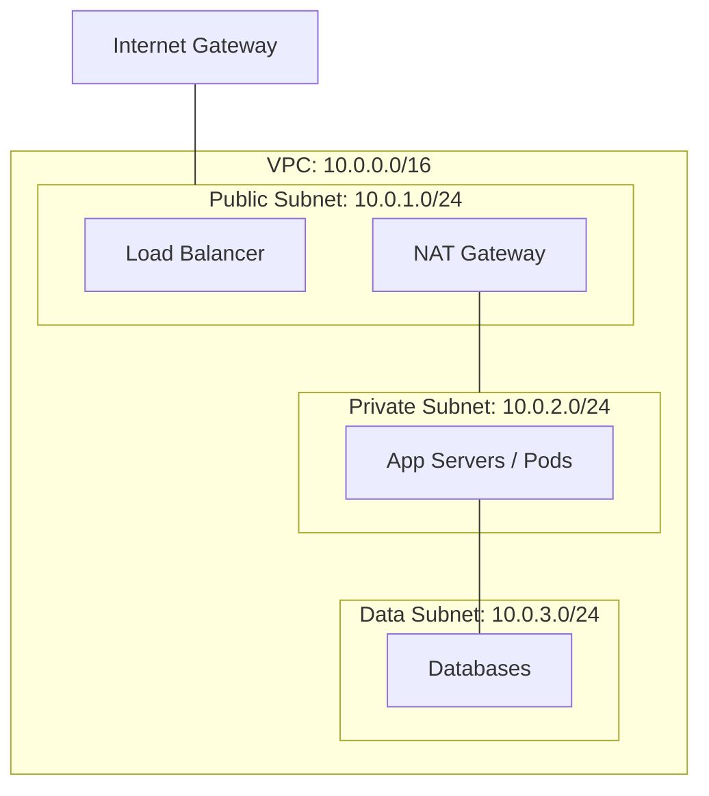

# VPC Design

You need to deploy a new environment. You pick a random CIDR block like `10.0.0.0/16`, create one big subnet, and attach an Internet Gateway. Six months later, you've run out of IPs, your database is publicly reachable by accident, and you can't peer with your corporate network because the IPs overlap. **This is why VPC design is the first step in building a professional platform.**

A Virtual Private Cloud (VPC) is your isolated slice of the cloud. Designing it correctly means balancing security, scalability, and connectivity.

## Quick Start: The Design Checklist

Before you write your first line of Terraform, answer these three questions:

1.  **IP Sizing**: How many resources will this VPC hold in 3 years? (Always allocate more than you think).
2.  **Segmentation**: Which resources need to be public (web) vs. private (databases)?
3.  **Connectivity**: Does this VPC need to talk to other VPCs or an on-premise data center?

```bash title="VPC Inspection Commands" linenums="1"
# AWS: List subnets and their CIDR blocks
aws ec2 describe-subnets --query 'Subnets[*].[SubnetId,CidrBlock,MapPublicIpOnLaunch]'

# Check the routing table for a specific subnet
aws ec2 describe-route-tables --filters "Name=association.subnet-id,Values=subnet-12345"
```

## Standard 3-Tier VPC Architecture

A professional VPC is typically organized into layers to enforce security boundaries.



<div class="grid cards" markdown>

-   :material-format-list-numbered: **CIDR Blocks**

    ---

    **Why it matters:** Defines the range of IP addresses available. `10.0.0.0/16` gives you 65,536 IPs; `10.0.0.0/24` gives you only 256.

    **Key insight:** Avoid `192.168.x.x` and common ranges like `172.17.0.0` (Docker default) to prevent future peering conflicts.

-   :material-router: **Routing Tables**

    ---

    **Why it matters:** Controls where traffic goes. A "Public" subnet is just a subnet whose routing table has a path to an Internet Gateway (`0.0.0.0/0 -> IGW`).

    **Key insight:** Private subnets should use a NAT Gateway for outbound internet (updates/patches) without being reachable from the inbound internet.

</div>

## Why VPC Design Matters for Platform Work

The VPC is the foundation of your "Blast Radius" and security posture:

*   **Security by Default**: Databases should reside in subnets with NO path to the internet, even through a NAT.
*   **Compliance**: Many frameworks (PCI, HIPAA) require strict network isolation between different classes of data.
*   **Interconnectivity**: Proper IP planning allows for seamless VPC Peering and Transit Gateway integration as your company grows.

## Common Scenarios & Solutions

=== ":material-ip-network: IP Exhaustion"

    **The Problem:** You try to launch a new instance/pod and get an error: "No available IP addresses in subnet."
    
    **SRE Check:**
    - Are your subnets too small? (e.g., `/28` only has 16 IPs, and cloud providers often reserve 5 of those).
    - Can you add a secondary CIDR block to the VPC?
    - Are you using "large" VPCs for small, temporary environments?

=== ":material-overlap: Overlapping CIDRs"

    **The Problem:** You need to peer two VPCs, but they both use `10.0.0.0/16`.
    
    **SRE Check:**
    - You cannot peer VPCs with overlapping CIDRs.
    - You may need to use a PrivateLink or a Proxy/NAT-based solution as a workaround.
    - Solution: Enforce a central IP Address Management (IPAM) registry.

=== ":material-door-closed: No Outbound Access"

    **The Problem:** Your private servers can't run `apt-get update`.
    
    **SRE Check:**
    - Does the routing table have a route for `0.0.0.0/0` pointing to a **NAT Gateway**?
    - Is the NAT Gateway itself located in a **Public Subnet**?
    - Does the NAT Gateway have an Elastic IP (EIP) attached?

## Practice Problems

??? question "Practice Problem 1: Subnetting Math"

    If you use `10.0.0.0/24` for a VPC, how many addresses are technically available in that range, and why might an AWS/Azure subnet in that range only let you use 251?

    ??? tip "Answer"

        A `/24` contains **256** addresses. However, major cloud providers reserve addresses for their own use (typically the first four and the last one) for things like the network address, the gateway, DNS (AmazonProvidedDNS), and the broadcast address.

??? question "Practice Problem 2: NAT vs IGW"

    Which component allows a server in a private subnet to download a security patch from the internet without allowing a hacker on the internet to initiate a connection to that server?

    ??? tip "Answer"

        The **NAT Gateway** (Network Address Translation). It allows outbound-initiated traffic and tracks the response to return it to the correct internal server, but it discards any inbound traffic that wasn't requested from the inside.

## Key Takeaways

| Term | Function | Location |
|:-----|:---------|:---------|
| **IGW** | Direct 2-way internet access | Public Subnet |
| **NAT Gateway** | Outbound-only internet access | Public Subnet |
| **Route Table** | The "brain" of the subnet's traffic | VPC Level |
| **NACL** | Stateless firewall for the whole subnet | Subnet Boundary |

## Further Reading

### Official Documentation
- [AWS VPC Design Best Practices](https://docs.aws.amazon.com/vpc/latest/userguide/vpc-network-design.html) - Comprehensive design guide.
- [Google Cloud VPC Overview](https://cloud.google.com/vpc/docs/vpc) - GCP's global VPC model.

### Related Tools
- **[Exploring Computer Science](https://cs.bradpenney.io)** - Master the math behind the bitmasks.
- **Multi-Region Networking** *(Mastery — coming soon)* - Taking your VPC design global.

### Deep Dives
- [IPv4 Address Planner](https://www.davidc.net/sites/default/subnets/subnets.html) - A visual tool for planning your CIDR splits.
