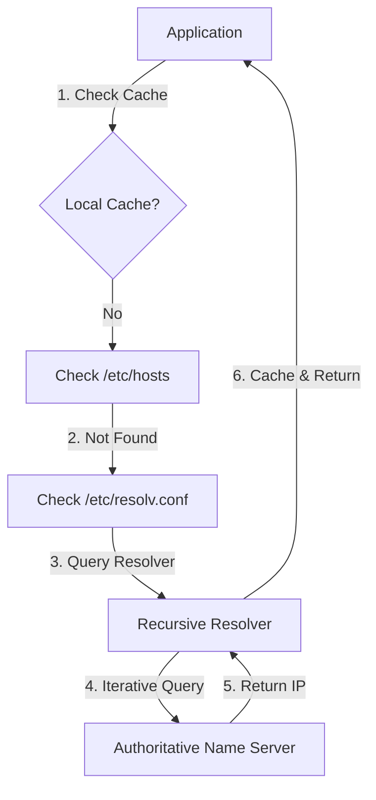

# DNS Debugging Basics

It's 2am. The API is timing out. You check the application logs and see a flurry of "Could not resolve host" errors. The database is up, the network seems fine, but your service can't find its dependencies. **This is why you need to master DNS debugging.**

DNS is often the "silent killer" of production systems. Because it's cached everywhere and relies on a complex chain of authority, it can break in subtle, frustrating ways. This guide focuses on the tools and mental models you need to identify and fix DNS issues fast.

## Quick Start: The 5-Minute Debug

If you suspect a DNS issue, follow this sequence:

1.  **Check basic resolution**: Use `dig` to see if the name resolves at all.
2.  **Verify the source**: Check if it's a global DNS issue or just your local `/etc/resolv.conf`.
3.  **Identify the error**: Look for `NXDOMAIN` (doesn't exist) vs `SERVFAIL` (lookup failed).

```bash title="Essential DNS Checks" linenums="1"
# Basic lookup
dig api.example.com

# Short answer (just the IP)
dig api.example.com +short

# Check a specific nameserver (e.g., Google's 8.8.8.8)
dig @8.8.8.8 api.example.com
```

## The DNS Resolution Workflow

Understanding how a request travels helps you pinpoint where the chain is broken.



<div class="grid cards" markdown>

-   :material-magnify: **dig (Domain Information Groper)**

    ---

    **Why it matters:** The industry standard for DNS lookups. It provides detailed timing, flags, and the exact response from the server.

    ```bash title="Detailed dig" linenums="1"
    dig +nocmd example.com any +multiline +noall +answer
    ```

    **Key insight:** Always look at the `status` field (e.g., `NOERROR`).

-   :material-server: **nslookup**

    ---

    **Why it matters:** Available on almost every OS (Windows/Linux/macOS). Good for quick checks, though less detailed than `dig`.

    ```bash title="Quick Check" linenums="1"
    nslookup api.example.com
    ```

    **Key insight:** Useful for verifying the default resolver used by the system.

</div>

## Why DNS Matters for Platform Work

In a modern platform environment, DNS isn't just about mapping names to IPs. It's the foundation for:

*   **Service Discovery**: Kubernetes uses internal DNS (CoreDNS) to let pods find each other.
*   **Load Balancing**: DNS-based load balancing (like AWS Route53) routes traffic to different regions.
*   **Security**: DNSSEC and TXT records (for SPF/DKIM) verify identity and prevent spoofing.

## Common Scenarios & Solutions

=== ":material-alert-circle: NXDOMAIN"

    **The Problem:** The domain name does not exist.
    
    **SRE Check:**
    - Is there a typo in the service name?
    - Has the record been created in the DNS provider?
    - If in Kubernetes, are you using the correct FQDN? (e.g., `service.namespace.svc.cluster.local`)

=== ":material-timer-off: SERVFAIL"

    **The Problem:** The resolver encountered a problem while looking up the name.
    
    **SRE Check:**
    - Is the authoritative nameserver down?
    - Is there a DNSSEC validation failure?
    - Check the glue records if you recently changed nameservers.

=== ":material-cached: Stale Records"

    **The Problem:** You changed an IP, but the old one is still being returned.
    
    **SRE Check:**
    - What is the TTL (Time to Live)? You may just need to wait.
    - Is a local cache (like `systemd-resolved`) holding onto the old record?
    - Use `dig +trace` to see the live records from the authoritative source.

## Practice Problems

??? question "Practice Problem 1: Interpreting Dig"

    You run `dig db.internal` and receive a status of `NXDOMAIN`. What does this tell you about the connection between your server and the DNS resolver?

    ??? tip "Answer"

        It tells you that the connection to the resolver is **working perfectly**. The resolver is successfully responding to say "I've checked, and that name definitely does not exist." The issue is with the record itself (or a typo), not the network.

??? question "Practice Problem 2: Testing Specific Resolvers"

    How would you test if a DNS resolution failure is specific to your company's internal DNS server vs a general internet issue?

    ??? tip "Answer"

        Compare the results of a standard `dig` (which uses your `/etc/resolv.conf`) against a lookup using a public resolver:
        
        `dig @8.8.8.8 google.com`
        
        If the public lookup works but the internal one fails, the problem lies with your internal DNS infrastructure or its upstream connectivity.

## Key Takeaways

| Status | Meaning | Action |
|:-------|:--------|:-------|
| **NOERROR** | Success | Check the `ANSWER SECTION` for the IP address. |
| **NXDOMAIN** | Non-Existent Domain | Check for typos or missing records. |
| **SERVFAIL** | Server Failure | Check the health of the authoritative nameserver. |
| **REFUSED** | Policy Refusal | Check for IP allowlists or rate limiting on the DNS server. |

## Further Reading

### Official Documentation
- [ISC Dig Manual](https://linux.die.net/man/1/dig) - Official documentation for the `dig` tool.
- [RFC 1035](https://datatracker.ietf.org/doc/html/rfc1035) - The original specification for DNS.

### Related Tools
- **[cs.bradpenney.io - DNS Deep Dive](https://cs.bradpenney.io)** - Understand the protocol theory behind these lookups.
- **[tools.bradpenney.io - dig](https://tools.bradpenney.io)** - Quick reference for `dig` flags.

### Community Resources
- [DNS Checker](https://dnschecker.org) - Global DNS propagation checker.
- [Mess with DNS](https://messwithdns.net) - An interactive playground to learn how DNS works.
