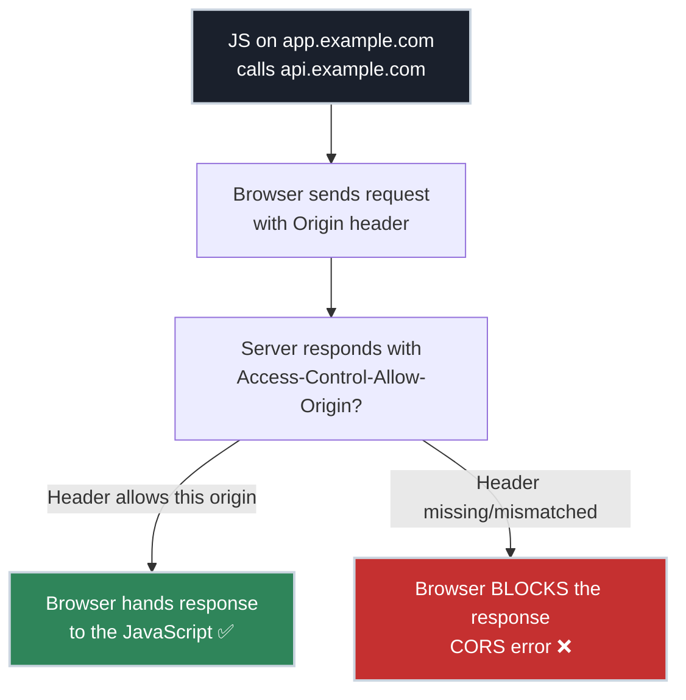
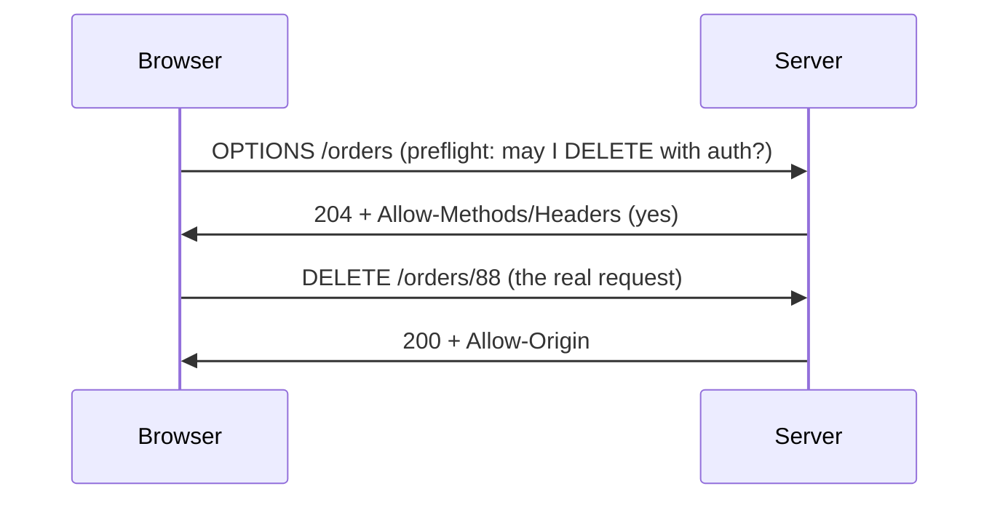

# CORS Explained: The Front-End/Back-End Border

!!! tip "Part of a Learning Path"
    This article is part of the [How APIs Actually Work](https://bradpenney.io/pathways/how-apis-work) pathway on [bradpenney.io](https://bradpenney.io) — a guided sequence through the topic. It also stands on its own.

Your API works perfectly. You `curl` it — `200 OK`. You hit it in Postman — `200 OK`. Then the front-end developer wires up their web app, and the browser console fills with red:

> Access to fetch at 'https://api.example.com/orders' from origin 'https://app.example.com' has been blocked by CORS policy.

Nothing about the API changed. `curl` and Postman still work. Only the *browser* refuses. This is the single most confusing thing about the front-end/back-end border, and it's confusing because **CORS isn't an API rule — it's a browser rule**, and the two tools you trust most don't enforce it.

This article makes CORS make sense: what the browser is protecting, why `curl` is exempt, and exactly which server response unblocks it.

## The Foundation: The Same-Origin Policy

Browsers enforce a deep security rule called the **Same-Origin Policy (SOP)**: by default, JavaScript running on one origin may not read responses from a *different* origin. An **origin** is the triple **scheme + host + port** — all three must match.

| URL of the page | URL it calls | Same origin? |
| :--- | :--- | :--- |
| `https://app.example.com` | `https://app.example.com/data` | ✅ Yes |
| `https://app.example.com` | `https://api.example.com/data` | ❌ No — different host |
| `https://app.example.com` | `http://app.example.com/data` | ❌ No — different scheme |
| `https://app.example.com` | `https://app.example.com:8443` | ❌ No — different port |

Why does the browser care? Because it carries your **ambient credentials** — cookies, sessions — and sends them automatically. Without SOP, any malicious site you visited could run JavaScript that calls `yourbank.com`, ride your logged-in session, and read your balance. SOP is what stops `evil.com` from quietly using your identity against another site. It's one of the foundations of web security.

!!! tip "Why curl and Postman 'work'"

    `curl` and Postman are **not browsers**. They have no logged-in user, no ambient cookies to protect, and no Same-Origin Policy. So they happily call any origin — which is exactly why your API "works" everywhere *except* the browser. CORS problems are invisible to your usual testing tools, and that's the root of the confusion.

## CORS Is the Permission System That Relaxes SOP

The Same-Origin Policy is a sensible default, but real apps legitimately need cross-origin calls — your front end on `app.example.com` *should* be able to call your API on `api.example.com`. **CORS (Cross-Origin Resource Sharing)** is the controlled mechanism for the *server* to say "these specific other origins are allowed to read my responses."

The critical mental shift: **CORS is the server granting permission, enforced by the browser.** The server attaches headers that say who's allowed; the browser reads those headers and decides whether to let the page's JavaScript see the response. If the headers don't grant permission, the browser blocks the *response* — even though the request may have already reached your server and run.



## The Header That Unblocks It

The browser sends an `Origin` header announcing where the page came from. The server grants access by echoing back an `Access-Control-Allow-Origin` header:

```http title="The request the browser sends" linenums="1"
GET /orders HTTP/1.1
Host: api.example.com
Origin: https://app.example.com
```

```http title="The response that grants permission" linenums="1"
HTTP/1.1 200 OK
Access-Control-Allow-Origin: https://app.example.com
Content-Type: application/json
```

If `Access-Control-Allow-Origin` matches the page's origin (or is the wildcard `*`), the browser releases the response to the JavaScript. If it's absent or doesn't match, the browser throws the CORS error — *regardless of the status code*. A `200 OK` with no CORS header still gets blocked.

This is why the fix is **always on the server**, never the front end. The front-end developer can't make the browser ignore CORS; only the server can send the header that grants permission.

## Preflight: The Request You Didn't Know You Made

Here's the part that mystifies people: sometimes the browser sends an *extra* request before the real one. For anything beyond a "simple" request — a `PUT`/`DELETE`/`PATCH`, a custom header like `Authorization`, or a JSON content type — the browser first sends an **`OPTIONS` preflight** to ask permission *before* sending the real request. Why does JSON count as "non-simple"? A plain HTML form (which predates `fetch`) can only send three content types — `application/x-www-form-urlencoded`, `multipart/form-data`, and `text/plain` — so the browser treats *those* as simple and anything else, including `application/json`, as needing permission first.

```http title="The preflight the browser sends automatically" linenums="1"
OPTIONS /orders HTTP/1.1
Origin: https://app.example.com
Access-Control-Request-Method: DELETE
Access-Control-Request-Headers: authorization
```

```http title="The server's preflight approval" linenums="1"
HTTP/1.1 204 No Content
Access-Control-Allow-Origin: https://app.example.com
Access-Control-Allow-Methods: GET, POST, DELETE
Access-Control-Allow-Headers: authorization
Access-Control-Max-Age: 600
```

Only if the preflight is approved does the browser send the actual `DELETE`. This is why your server must **handle `OPTIONS`** on CORS-enabled routes — if `OPTIONS` returns a `404` or `405`, the real request never even fires, and the developer sees a baffling error about a request they never wrote. `Access-Control-Max-Age` lets the browser cache the approval so it doesn't preflight every call.

!!! warning "A redirect on the preflight kills the request"

    The browser will **not** follow a `3xx` redirect returned to an `OPTIONS` preflight — it treats it as a CORS failure and stops. This bites surprisingly often when an API redirects `/orders` to `/orders/` (trailing slash): the preflight gets a `301`, the browser blocks it, and the real request never fires. Answer the preflight with a `2xx` directly on CORS-enabled routes — no redirect.



## The Headers That Matter

| Header | Sent by | Purpose |
| :--- | :--- | :--- |
| `Origin` | browser | Announces the calling page's origin |
| `Access-Control-Allow-Origin` | server | Which origin(s) may read the response |
| `Access-Control-Allow-Methods` | server | Which methods are permitted (preflight) |
| `Access-Control-Allow-Headers` | server | Which request headers are permitted (preflight) |
| `Access-Control-Allow-Credentials` | server | Whether cookies/credentials may be sent |
| `Access-Control-Max-Age` | server | How long the browser may cache the preflight approval |

!!! warning "The wildcard trap with credentials"

    `Access-Control-Allow-Origin: *` allows any origin — convenient, but it **cannot** be combined with `Access-Control-Allow-Credentials: true`. The browser forbids sending cookies to a wildcard origin (it would let *any* site use a user's credentials — the exact attack SOP prevents). For credentialed requests you must echo back the *specific* requesting origin, not `*`. This pairing catches almost everyone the first time.

## Why This Matters for Platform Work

- **CORS errors are a server configuration task disguised as a front-end bug.** The browser console blames the front end, but the resolution is always a server response header. Knowing this stops the cross-team finger-pointing: the front-end dev is *reporting* the problem, not causing it.
- **It explains the "works in Postman, fails in the browser" report you'll get constantly.** Your testing tools don't enforce SOP. The first time someone says "your API is broken but only in the app," CORS is the prime suspect.
- **Misconfiguring it is a real security hole.** Reflecting *any* origin back (echoing whatever `Origin` arrives) or pairing `*` with credentials can re-open the cross-site door SOP exists to close. CORS should *widen* access deliberately to known origins, not blanket-allow.

## Common Scenarios

=== ":material-flask: 'Works in Postman, not the browser'"

    The request succeeds in Postman/`curl` but the browser shows a CORS error. The API is missing `Access-Control-Allow-Origin` for the front end's origin. Postman doesn't enforce SOP, so it never noticed. Fix: configure the server to return the allow-origin header for the front-end's origin. This is the single most common CORS report.

=== ":material-help-box: A mysterious OPTIONS 404"

    Logs show an `OPTIONS /orders` returning `404` or `405`, and the real request never arrives. The route doesn't handle **preflight**. The browser asked permission, got rejected, and refused to send the actual request. Fix: ensure the framework/gateway answers `OPTIONS` with the appropriate `Access-Control-Allow-*` headers (most CORS middleware does this automatically once enabled).

=== ":material-cookie-alert: Cookies not being sent cross-origin"

    Auth works same-origin but the session cookie isn't sent cross-origin. Two things must align: the client must opt in (`fetch(..., { credentials: 'include' })`) **and** the server must send `Access-Control-Allow-Credentials: true` with a *specific* (non-wildcard) `Access-Control-Allow-Origin`. Miss either and the browser drops the credentials.

## Practice Problems

??? question "Practice Problem 1: Whose Bug Is It?"

    A front-end developer says, "Your API is broken — I get a CORS error." You test the exact same endpoint with `curl` and get a clean `200 OK`. Is the API broken? Who fixes this and how?

    ??? tip "Solution"

        The API isn't "broken" in the sense the developer means — it returns correct data, which is why `curl` succeeds. But it's **misconfigured for browser clients**: it isn't sending `Access-Control-Allow-Origin` for the front-end's origin, so the **browser** (not the API) blocks the response. `curl` has no Same-Origin Policy, so it never sees a problem. The fix is on the **server**: configure it to return the allow-origin header for the front-end's origin (and handle `OPTIONS` preflight). The front-end developer can't fix it from their side — only the server can grant permission.

??? question "Practice Problem 2: The Phantom OPTIONS Request"

    Your API logs show occasional `OPTIONS` requests to endpoints your front end calls with `DELETE` — but your code never sends `OPTIONS`. Where are they coming from, and what happens if you return `404` to them?

    ??? tip "Solution"

        The **browser** sends them automatically as **CORS preflight** requests. Because `DELETE` (and custom headers like `Authorization`) aren't "simple," the browser asks permission with an `OPTIONS` request *before* sending the real `DELETE`. If you return `404`/`405` to the preflight, the browser concludes the cross-origin call isn't allowed and **never sends the actual `DELETE`** — the developer sees a CORS failure for a request that never left the browser. You must answer `OPTIONS` with the appropriate `Access-Control-Allow-Methods`/`Allow-Headers`.

??? question "Practice Problem 3: The Insecure Fix"

    Under deadline pressure, an engineer makes all CORS errors disappear by configuring the server to read the incoming `Origin` header and echo it straight back into `Access-Control-Allow-Origin`, plus `Access-Control-Allow-Credentials: true`. Why is this dangerous?

    ??? tip "Solution"

        Echoing back *whatever* origin arrives means the server allows **every** origin — including `https://evil.com` — and combining that with `Allow-Credentials: true` tells the browser it's fine to send the user's **cookies** to those cross-origin requests. That re-creates exactly the attack the Same-Origin Policy prevents: a malicious site can now make credentialed calls to your API using a logged-in victim's session and read the responses. CORS should allow a **known list** of trusted origins, never reflect arbitrary ones with credentials enabled.

## Key Takeaways

| Concept | What It Means |
| :--- | :--- |
| **Same-Origin Policy** | Browsers block cross-origin reads by default to protect ambient credentials |
| **Origin** | scheme + host + port — all three must match to be "same origin" |
| **CORS** | The *server* grants cross-origin permission; the *browser* enforces it |
| **curl/Postman exempt** | No SOP → no CORS → "works everywhere but the browser" |
| **Preflight** | Browser sends `OPTIONS` first for non-simple requests; the server must answer it |
| **Fix is server-side** | `Access-Control-Allow-*` headers; never reflect arbitrary origins with credentials |

CORS feels like the browser fighting you, but it's the browser protecting your users — refusing to let arbitrary sites spend their credentials behind their backs. Once you see that the Same-Origin Policy is the default, CORS is the *server's* way to relax it on purpose, and `curl`/Postman simply don't play the game, the red console errors stop being a mystery and become a one-line server header. That's the front-end/back-end border, finally drawn in ink.

## Further Reading

### Related Networking Articles

- **[From URL to Endpoint](../../essentials/http/from_url_to_endpoint.md)** — what "origin" means at the network level.
- **[Reverse Proxies and API Gateways](../api_gateways/reverse_proxies_and_gateways.md)** — CORS headers are often applied at the gateway.

### Computer Science Fundamentals

- **[Anatomy of an HTTP Request and Response (cs.bradpenney.io)](https://cs.bradpenney.io/efficiency/web/anatomy_of_request_response/)** — the headers and methods CORS relies on.
- **[Client and Server: The Request/Response Lifecycle (cs.bradpenney.io)](https://cs.bradpenney.io/efficiency/web/client_server_request_response/)** — why the front end is an untrusted client.

### External Resources

- [MDN: Cross-Origin Resource Sharing (CORS)](https://developer.mozilla.org/en-US/docs/Web/HTTP/Guides/CORS) — the definitive reference.
- [MDN: Same-origin policy](https://developer.mozilla.org/en-US/docs/Web/Security/Defenses/Same-origin_policy) — the rule CORS relaxes.
- [web.dev: Cross-Origin Resource Sharing](https://web.dev/articles/cross-origin-resource-sharing) — a practical walkthrough.
