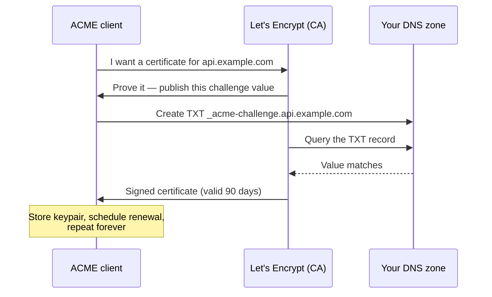

# Automating TLS Certificates: ACME and Let's Encrypt

!!! tip "Part of a Learning Path"
    This article is part of the [Put Your Kubernetes App on the Internet](https://bradpenney.io/pathways/cluster-to-internet) pathway on [bradpenney.io](https://bradpenney.io) — a guided sequence through the topic. It also stands on its own.

"The site is down. `SSL_ERROR_EXPIRED_CERT`." You check the calendar: it's exactly one certificate lifetime since someone last renewed by hand, and that someone left the company six months ago.

Certificate expiry is the most preventable outage in production, because the entire problem has been solved *at the protocol level*: **ACME**, a protocol that lets machines prove domain ownership and get certificates issued with no human in the loop, and **Let's Encrypt**, the free CA built around it. This article is about that machinery: how the proof actually works, the discipline that keeps you inside the CA's rate limits, and the tiers of tooling that run it for you. Understand the protocol once, and every ACME client you'll ever meet — from a cron job to a cluster controller — becomes the same story with different packaging.

## Pick Your Level of Automation

The same ACME protocol drives three tiers of tooling — match the tool to what you're running:

-   :material-server: **`certbot` — one server**

    ---

    **Why it matters:** the original ACME client, right for a single VM running a web server.

    A cron/systemd timer renews and reloads. Fine at small scale; humans still own *which machines* run it.

    [:octicons-arrow-right-24: certbot documentation](https://certbot.eff.org/)

-   :material-swap-horizontal: **Traefik's built-in ACME — one proxy**

    ---

    **Why it matters:** the [reverse proxy](../api_gateways/reverse_proxies_and_gateways.md) that terminates TLS can fetch its own certificates.

    Point Traefik at an ACME resolver and every route it serves gets issued and renewed in-process. Great until certificates need to outlive one proxy's storage.

    [:octicons-arrow-right-24: Traefik's ACME resolvers](https://doc.traefik.io/traefik/reference/install-configuration/tls/certificate-resolvers/acme/)

-   :material-kubernetes: **cert-manager — a fleet**

    ---

    **Why it matters:** the Kubernetes-native answer — certificates become declarative cluster resources, reconciled forever.

    The protocol below is exactly what it runs; the cluster machinery has its own article.

    [:octicons-arrow-right-24: cert-manager on the Kubernetes site](https://k8s.bradpenney.io/efficiency/networking/cert_manager/)

Whichever tier you run, the interesting part is the same: how does a certificate authority let a *machine* prove it owns a domain?

## ACME: How a Machine Proves You Own a Domain

A CA will only sign a certificate for `example.com` after you *prove control* of `example.com` — and ACME (RFC 8555) is that proof, negotiated entirely between machines. The CA hands your client a **challenge**; your client makes the answer visible somewhere only the domain's real controller could; the CA checks and signs.

Two challenge types do essentially all the work, and choosing between them is the one real decision:

=== ":material-web: HTTP-01 — prove it on port 80"

    The CA says: "serve this token at `http://example.com/.well-known/acme-challenge/<token>`." If your client can make that URL answer correctly, it controls the web server the domain points at.

    - **Requires**: the domain resolves publicly and **port 80 is reachable from the internet**. The CA connects from outside; no exceptions.
    - **Can't do**: wildcard certificates, or anything internal-only. If Let's Encrypt can't reach it, HTTP-01 can't prove it.
    - **Operationally simple**: no DNS provider credentials needed — which is why it's the default when it fits.

=== ":material-dns: DNS-01 — prove it in the zone"

    The CA says: "publish this value as a TXT record at `_acme-challenge.example.com`." Only someone who controls the [zone](../../essentials/dns/how_dns_works.md) can do that — so control of DNS *is* the proof.

    - **Requires**: API credentials for your DNS host, so the client can create records — a real secret to manage and scope carefully (ideally to TXT records under `_acme-challenge`).
    - **Unlocks what HTTP-01 can't**: **wildcards** (`*.example.com`) and certificates for **services the internet can't reach** — the CA only ever looks at public DNS, never at your service.
    - Remember the [TXT record's role](../../essentials/dns/how_dns_works.md): this is exactly the "machines prove ownership through DNS" case.

The certificates are deliberately short-lived — Let's Encrypt's are **90 days**. That's not stinginess; it's design: lifetimes short enough that manual renewal is untenable *force* automation, and a stolen key expires quickly. Renewal is just the same challenge again, which clients trigger automatically at about two-thirds of the lifetime — roughly 30 days before expiry, leaving weeks of retry room if something breaks quietly.

!!! warning "Staging first — production rate limits are real"
    Let's Encrypt's production endpoint enforces rate limits (per-domain issuance caps, failed-validation limits). A CI loop or a misconfigured client retrying against production can lock your domain out of issuance for days. The discipline: **develop and test against the staging endpoint** — its certificates aren't browser-trusted, which is fine for testing — and switch to production only when the staging flow completes cleanly.

## Not Everything Is Let's Encrypt: The Private CA

ACME with a public CA assumes the CA can *see* your domain — but plenty of certificates front names that will never be public: `*.internal.corp`, service-to-service traffic, on-prem tooling. Those get certificates from a **[private CA](../../essentials/tls/tls_basics.md)**: a root you control, distributed to your clients' trust stores, signing certificates with the same chains, short lifetimes, and automation as the public web. The issuance tooling changes (in Kubernetes, [cert-manager's CA issuer](https://k8s.bradpenney.io/efficiency/networking/cert_manager/) implements exactly this); the discipline doesn't. What *never* comes back is the [self-signed certificate](../../essentials/tls/tls_basics.md) — automation made real chains cheap enough that anchorless certs have no remaining excuse.

## Why This Matters for Platform Work

- **Expiry stops being an event.** Not "we get reminded earlier" — the concept disappears from the calendar. The only certificate dates a platform team should ever discuss are the ones on systems not yet automated.
- **The challenge type is an architecture decision.** HTTP-01 binds you to public port-80 reachability; DNS-01 binds you to DNS-provider credentials. Wildcards and internal services force DNS-01 — know which constraint you're accepting before the design review.
- **Rate limits are a production dependency.** The CA is an external service with quotas; treat issuance like any other rate-limited API — staging for tests, production issuance only from long-lived environments.

## Common Scenarios

=== ":material-dns-outline: DNS-01 keeps failing"

    The client reports TXT-record errors. Three usual causes: the **DNS provider credentials** are wrong or under-scoped (look for `Forbidden` in its logs); **split-horizon DNS** — your internal resolvers see the record but the public zone the CA queries never got it; or plain **propagation patience** — good clients verify the record is publicly visible before asking the CA to look, but a slow secondary can still drag.

=== ":material-sync-alert: Renewed, but clients still get the old cert"

    The renewal succeeded; `openssl s_client` against the live endpoint still shows the old certificate. The certificate isn't the problem — the **termination point** hasn't picked it up: a web server that needs a reload, or a CDN/external load balancer in front holding *its own* cached copy. Verify what's actually served vs. what was issued, then find the layer holding the stale copy.

=== ":material-api: 'too many requests' from the CA"

    You've hit production rate limits — almost always automation issuing real certificates per test run, or a broken client retrying in a tight loop. Switch tests to the **staging** endpoint, wait out the limit window, and add the guard that prevents recurrence: production issuance only from long-lived environments, never ephemeral ones.

## Practice Problems

??? question "Practice Problem 1: Choose the Challenge"

    Three certificates to automate: (a) `www.example.com`, public site, port 80 open; (b) `*.apps.example.com` for dynamically created environments; (c) `grafana.internal.example.com`, resolvable and reachable only inside the VPC. Which challenge type does each need, and what new operational dependency appears the moment you need the second one?

    ??? tip "Answer"

        (a) **HTTP-01**: public, port 80 reachable, single name — the simple case, no DNS credentials needed. (b) **DNS-01, mandatory**: wildcards can only be proven by zone control. (c) **DNS-01 again**: the CA can't reach the service, but it never needs to: it only queries *public* DNS for the TXT record, so internal services get publicly-trusted certs as long as the zone is publicly visible. The new dependency: **DNS provider API credentials** held by your ACME client — a real secret that can modify your zone, to be scoped (ideally to TXT records under `_acme-challenge`) and rotated like any other credential.

??? question "Practice Problem 2: Why Renew at Two-Thirds?"

    Let's Encrypt certificates last 90 days, and well-behaved clients renew at roughly day 60 rather than day 89. A teammate calls that wasteful — "we're throwing away a third of every certificate." Defend the design.

    ??? tip "Answer"

        The 30-day gap is the **failure budget**. Renewal is an unattended, network-dependent operation against an external CA: DNS credentials expire, zones get migrated, port 80 gets firewalled by an unrelated change, the CA has an outage, rate limits bite. Renewing at day 60 means a silent failure has **30 days of retries** — and 30 days for monitoring to page a human — before anything user-visible happens. Renewing at day 89 turns any one of those mundane failures into an outage. Nothing is "thrown away": certificates aren't a consumable, and the CA issues them for free — the early renewal buys the only thing that matters, which is time to notice.

## Key Takeaways

| Concept | What It Means |
| :--- | :--- |
| **ACME** | Machine-negotiated proof of domain control (RFC 8555) — the protocol under all of this |
| **HTTP-01** | Token on port 80; simple, but public-only and no wildcards |
| **DNS-01** | TXT record in the zone; unlocks wildcards and internal services, costs DNS API credentials |
| **90-day certs** | Short on purpose — untenable manually, safe automatically; renewal at ~2/3 lifetime |
| **Staging vs prod** | Test against staging; production rate limits can lock a domain out for days |
| **The tiers** | certbot for a server, Traefik for a proxy, cert-manager for a cluster — one protocol underneath |
| **Private CA** | Same automation and chains for names the internet never sees; self-signed stays dead |

Expired certificates were an era, and the protocol ended it: a machine proves ownership, a client renews on schedule, and the humans keep the credentials scoped and the tests on staging. How this looks when a *cluster* runs the client — certificates as desired state, filled into Secrets behind your Gateway — is the [Kubernetes side of this story](https://k8s.bradpenney.io/efficiency/networking/cert_manager/).

## Further Reading

### Related Networking Articles

- **[TLS Basics: Certificates, Handshakes, and the Chain of Trust](../../essentials/tls/tls_basics.md)** — what these certificates *are*, and the chain the automation keeps intact.
- **[How DNS Actually Works](../../essentials/dns/how_dns_works.md)** — TXT records and TTLs, the machinery DNS-01 rides on.
- **[Reverse Proxies and API Gateways, Demystified](../api_gateways/reverse_proxies_and_gateways.md)** — the termination point these certificates get mounted at.

### On the Kubernetes Site

- **[cert-manager: Certificates as Cluster Resources (k8s.bradpenney.io)](https://k8s.bradpenney.io/efficiency/networking/cert_manager/)** — this protocol, run by a cluster controller: Issuers, Certificates, and the Gateway integration.

### External Resources

- [RFC 8555: ACME](https://datatracker.ietf.org/doc/html/rfc8555) — the protocol itself; Section 8 covers the challenges.
- [Let's Encrypt: Rate Limits](https://letsencrypt.org/docs/rate-limits/) — the exact limits your staging discipline protects you from.
