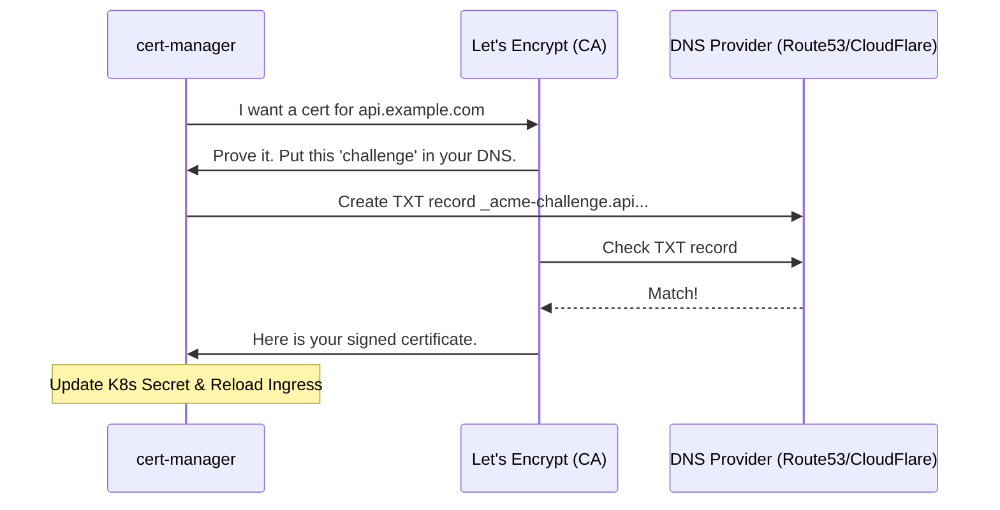

# Certificate Management

"The site is down! SSL_ERROR_EXPIRED_CERT." You check the calendar—it's exactly 90 days since you last manually uploaded a certificate to your load balancer. You forgot the renewal, again. **This is why manual certificate management is a production anti-pattern.**

In a world of microservices and ephemeral environments, you can't rely on humans to remember expiration dates. You need automation that handles the issuance, renewal, and deployment of certificates.

## Quick Start: Automating with cert-manager

If you are running in Kubernetes, `cert-manager` is the industry standard for certificate automation.

1.  **Install cert-manager**: Deploys the controllers to your cluster.
2.  **Configure an Issuer**: Tell cert-manager where to get certificates (e.g., Let's Encrypt).
3.  **Create a Certificate Resource**: Define the domain and the secret where the cert will be stored.

```yaml title="A Basic cert-manager Certificate" linenums="1"
apiVersion: cert-manager.io/v1
kind: Certificate
metadata:
  name: api-cert
  namespace: prod
spec:
  secretName: api-tls-secret  # (1)!
  dnsNames:
  - api.example.com
  issuerRef:
    name: letsencrypt-prod
    kind: ClusterIssuer
```

1. This is where the `.crt` and `.key` files will be stored for your Ingress to use.

## The ACME Protocol Flow

How Let's Encrypt verifies you actually own the domain before giving you a certificate.



<div class="grid cards" markdown>

-   :material-infinity: **Let's Encrypt**

    ---

    **Why it matters:** A free, automated, and open Certificate Authority (CA). It changed the internet by making "HTTPS by default" possible.

    **Key insight:** Let's Encrypt certificates only last **90 days**. This is intentional—it *forces* you to automate.

-   :material-cog-sync: **cert-manager**

    ---

    **Why it matters:** The "operator" for certificates in Kubernetes. It monitors your `Certificate` resources and automatically triggers renewals 30 days before expiration.

    **Key insight:** Use the `ClusterIssuer` for certificates used across multiple namespaces.

</div>

## Why Automation Matters for Platform Work

Automated certificate management is about more than just avoiding outages:

*   **Security**: Short-lived certificates (90 days vs 1 year) reduce the window of opportunity if a private key is compromised.
*   **Scalability**: Automatically provision TLS for every new preview environment, branch, or customer tenant without manual intervention.
*   **Consistency**: Ensure every service in your mesh uses the same high standards for encryption and CA trust.

## Common Scenarios & Solutions

=== ":material-dns-outline: DNS Challenge Failures"

    **The Problem:** cert-manager can't verify ownership.
    
    **SRE Check:**
    - Does cert-manager have the correct API keys for your DNS provider (AWS/CloudFlare)?
    - Is there a "Split Brain DNS" where Let's Encrypt sees a different record than your internal network?
    - Check the logs: `kubectl logs -n cert-manager ...` and look for `Forbidden` or `NXDOMAIN`.

=== ":material-sync-alert: Renewal Loop"

    **The Problem:** The certificate is renewed, but the load balancer/ingress is still serving the old one.
    
    **SRE Check:**
    - Some Ingress controllers don't automatically reload when a secret changes.
    - Check for "Certificate Flapping"—where two different issuers are trying to manage the same secret.
    - Use `openssl s_client` to verify what the *live* service is serving.

=== ":material-api: Rate Limiting"

    **The Problem:** Let's Encrypt returns "too many requests."
    
    **SRE Check:**
    - Are you using the **Production** issuer for testing? Always use the **Staging** issuer during development to avoid hitting rate limits.
    - Are you creating/deleting certificates in a tight loop during CI/CD?

## Practice Problems

??? question "Practice Problem 1: HTTP-01 vs DNS-01"

    What is the main advantage of using a **DNS-01** challenge over an **HTTP-01** challenge for certificate validation?

    ??? tip "Answer"

        **DNS-01** allows you to issue certificates for **Wildcard domains** (e.g., `*.example.com`) and for services that are **not reachable from the public internet** (internal tools). HTTP-01 requires Let's Encrypt to be able to reach your server on port 80, which is impossible for private VPC resources.

??? question "Practice Problem 2: The cert-manager Secret"

    When cert-manager successfully issues a certificate, where does it store the resulting public and private keys?

    ??? tip "Answer"

        In a **Kubernetes Secret** (of type `kubernetes.io/tls`). The name of this secret is defined in the `secretName` field of your `Certificate` resource. Your Ingress controller or application then mounts this secret to use the files.

## Key Takeaways

| Tool | Purpose |
|:-----|:--------|
| **ACME** | The protocol used to automate certificate issuance and renewal. |
| **Let's Encrypt** | The most popular CA providing free, automated certificates. |
| **cert-manager** | The Kubernetes-native tool for managing ACME certificates. |
| **Trust Store** | The collection of Root certificates your system trusts to validate the CA. |

## Further Reading

### Official Documentation
- [cert-manager Documentation](https://cert-manager.io/docs/) - Comprehensive setup and configuration guides.
- [ACME Protocol (RFC 8555)](https://datatracker.ietf.org/doc/html/rfc8555) - The technical spec.

### Related Tools
- **[tls/essentials/tls_basics.md](../../essentials/tls/tls_basics.md)** - Refresh your knowledge on why we need certificates in the first place.
- **[kubernetes_networking/efficiency/services_and_ingress.md](../kubernetes_networking/services_and_ingress.md)** - How to use these certificates with your Ingress resources.

### Community Resources
- [Let's Encrypt Community Forum](https://community.letsencrypt.org/) - Excellent place for troubleshooting obscure ACME errors.
