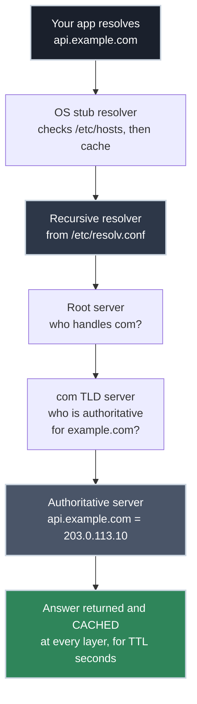

# How DNS Actually Works: Resolution, Records, and TTLs

!!! tip "Part of a Learning Path"
    This article is part of the [Put Your Kubernetes App on the Internet](https://bradpenney.io/pathways/cluster-to-internet) pathway on [bradpenney.io](https://bradpenney.io) — a guided sequence through the topic. It also stands on its own.

It's migration day. You've moved the API to new infrastructure, updated the A record to the new IP, and confirmed it with `dig`. An hour later, monitoring shows half your traffic still arriving at the old server. Nothing is broken — this is DNS working exactly as designed, and it will keep "misbehaving" until you understand the machinery underneath.

In [From URL to Endpoint](../http/from_url_to_endpoint.md) we treated DNS as a single step: a name goes in, an IP comes out. This article opens that box. Everything inside it hangs on four questions about that answer: **who** gives it, **what** it contains, **how long** it lives, and **who controls** it. Walk those four in order, and "waiting for DNS to propagate" turns out to be a myth with a precise replacement — and the migration-day mystery above gets an exact explanation, and a fix.

## A Name Is a Path Through a Tree

DNS is not a lookup table on some central server. It's a **distributed, hierarchical database**: a tree of zones, where each level only knows who to ask about the level below it.

Read `api.example.com.` right to left (that trailing dot is real; it's the root of the tree):

| Level | Who runs it | What it knows |
| :--- | :--- | :--- |
| `.` (root) | 13 root server clusters, operated by 12 organizations | Which servers handle each TLD (`com`, `org`, `io`, …) |
| `com` | The TLD registry (Verisign for `com`) | Which nameservers are **authoritative** for `example.com` |
| `example.com` | Whoever the domain owner delegates to | Every record in the zone: `api`, `www`, mail settings, … |

Each arrow down the tree is a **delegation**, expressed as NS records: "I don't know `api.example.com`, but *these* servers do — go ask them." No single machine holds the whole database, which is exactly why DNS has survived at internet scale since the 1980s.

That's the map. The first of our four questions, *who actually gives you an answer*, is about the actors who walk it.

## Who Actually Answers: The Resolution Chain

When your code asks for `api.example.com`, two very different kinds of servers get involved:

- A **recursive resolver** does the legwork. It's the server listed in `/etc/resolv.conf`: your ISP's, your cloud provider's, or a public one like `1.1.1.1`. It chases the delegation chain on your behalf and **caches** what it learns.
- An **authoritative server** holds the actual records for a zone. It doesn't chase anything — it *is* the answer.



The recursive resolver only walks the full chain on a **cache miss**. Most queries never leave it; the answer is already cached from someone else's lookup. That cache is what makes DNS fast, and it's also the entire reason your migration-day traffic split in half.

You can watch the full chain yourself:

```bash title="Walk the delegation chain by hand" linenums="1"
dig +trace api.example.com   # (1)!

# .              518400  IN  NS  a.root-servers.net.
# com.           172800  IN  NS  a.gtld-servers.net.
# example.com.   172800  IN  NS  ns1.example-dns.com.
# api.example.com. 300   IN  A   203.0.113.10
```

1. `+trace` makes `dig` act like a recursive resolver: it starts at the root and follows each delegation itself, ignoring all caches.

Reading the trimmed output top to bottom, you're watching the tree from the previous section answer level by level: the root servers say who handles `com`; the `com` TLD servers hand over `example.com`'s nameservers; and the final line is the authoritative answer: the only record here that came from servers *you* control.

## The Records You'll Actually Touch

So much for *who* answers. Question two, *what the answer contains*, is the zone itself: a collection of records, and these are the types that matter for putting a service on the internet:

| Record | Maps | You'll touch it when |
| :--- | :--- | :--- |
| **A** | name → IPv4 address | Pointing a domain at a server or load balancer |
| **AAAA** | name → IPv6 address | Same, for IPv6 |
| **CNAME** | name → another name | Aliasing `www.example.com` to `example.com`, or a name to a cloud load balancer's hostname |
| **NS** | zone → its authoritative servers | Delegating a domain (or subdomain) to a DNS host |
| **SOA** | zone → its metadata | Rarely by hand — but its serial number and negative-cache TTL affect you (more below) |
| **TXT** | name → arbitrary text | Proving domain ownership: ACME certificate challenges, SPF/DKIM for mail |
| **MX** | domain → mail servers | Setting up email — and never your app traffic |

Two rules that bite people constantly:

- **A CNAME cannot coexist with other records at the same name.** That's why the zone apex (`example.com` itself) usually can't be a CNAME to your load balancer; DNS hosts offer workarounds (`ALIAS`/`ANAME` records) precisely because of this rule.
- **TXT records are how machines prove you own a name.** When [certificate issuance is automated](../../efficiency/tls/certificate_management.md), the certificate authority verifies domain ownership through exactly these records.

## TTLs: Why "Propagation" Is a Myth

Question three, *how long an answer lives*, is the one the migration-day mystery hangs on. Every DNS answer carries a **TTL (time to live)**: the number of seconds any cache is allowed to keep serving it. When you "wait for DNS to propagate," nothing is being pushed anywhere. You are simply waiting for every cache on the planet that holds your old record to hit its TTL and expire it.

```bash title="Watch a cached record count down" linenums="1"
dig +noall +answer api.example.com   # (1)!
# api.example.com.  287  IN  A  203.0.113.10

dig +noall +answer api.example.com   # (2)!
# api.example.com.  241  IN  A  203.0.113.10
```

1. The second column of the answer (`287`) is the **remaining** TTL at this resolver; this record was cached 13 seconds ago with a TTL of 300.
2. Ask again and it's lower (`241`). When it hits 0, the resolver re-queries the authoritative server and picks up your change.

This is why your migration split traffic: resolvers that happened to cache the old A record kept serving it until *their* copy expired. Different resolvers cached it at different times, so the old IP faded out gradually instead of switching cleanly.

The professional playbook follows directly from the mechanism:

1. **Before the change**, at least one *old* TTL in advance, lower the record's TTL (say, from `3600` to `60`). The old TTL governs how long the old value can live in caches: with a 3600-second TTL, one hour after you lower it, every cache on the planet holds the 60-second version.
2. **Make the cutover.** Worst-case staleness is now 60 seconds, not an hour.
3. **After it settles**, raise the TTL back up. Low TTLs mean more queries hitting your authoritative servers and slower lookups for clients; they're a migration tool, not a permanent setting.

!!! warning "NXDOMAIN gets cached too"
    Resolvers also cache *negative* answers ("that name doesn't exist") for a duration set in the zone's SOA record. If you query a subdomain **before** creating its record, you can cache the failure and then stare at NXDOMAIN for minutes after the record exists. Create first, query second.

## Where Your Records Actually Live

The last question, *who controls the answer*, is where "add a DNS record" involves up to three different parties, and knowing which one owns what saves real confusion:

- **The registrar** is where you bought the domain. Its one DNS job is telling the TLD which nameservers are authoritative for your zone: the NS delegation. You touch it when changing DNS hosts, and almost never otherwise.
- **The DNS host** runs the authoritative servers for your zone. This is where records get added and edited. It might be a managed service (Route 53, Cloudflare) or servers you run yourself, typically [BIND9](https://www.isc.org/bind/), the software that has served much of the internet's DNS for decades.
- **The zone** is the actual data: your A, CNAME, and TXT records, plus the SOA and NS records describing the zone itself.

The registrar and DNS host are often the same company, which hides the distinction — until the day you migrate DNS hosts and discover the registrar's NS records are the thing that needed changing.

## Why This Matters for Platform Work

- **Cutovers become schedulable instead of scary.** TTL math tells you exactly when a change is fully live, so "did DNS propagate yet?" becomes "the old TTL was 300, it's been 6 minutes, we're done."
- **You know which layer to interrogate.** `dig` against your default resolver shows the *cached* world; `dig +trace` (or querying the authoritative server directly with `dig @ns1.example-dns.com`) shows the *true* one. Disagreement between them isn't a mystery anymore — it's a countdown.
- **DNS is the first dependency of everything else.** Monitoring, service discovery, certificate issuance, and every outbound call assume resolution just works, so when DNS wobbles, systems above it fail in ways that point everywhere *except* DNS. Knowing this layer keeps it on your suspect list.

!!! info "Running Kubernetes? You already operate all of this"
    The cluster DNS your Pods use (CoreDNS) is a recursive resolver, Services get names in a cluster-internal zone, and cached answers expire on TTLs: this article's machinery in miniature, one cluster wide. Same protocol, same mental model, same debugging instincts.

## Common Scenarios

=== ":material-cached: 'I changed the record, users see the old IP'"

    Not broken — cached. Check the remaining TTL your resolver holds (`dig +noall +answer`), and compare against the authoritative answer (`dig +trace`). If authoritative is right, the rollout is just caches expiring on schedule. The lesson for next time: lower the TTL an old-TTL ahead of the change.

=== ":material-help-circle: 'New subdomain works for everyone but me'"

    You queried it before the record existed and your resolver cached the NXDOMAIN. Negative caching expires like any other TTL. Or sidestep it: ask a different resolver (`dig @1.1.1.1 new.example.com`) to confirm the record is really live.

=== ":material-earth: 'Bought a domain, nothing resolves'"

    Records live in a zone, but the tree has to *reach* that zone. If the registrar hasn't set your DNS host's nameservers in the NS delegation, authoritative servers full of correct records will never be asked. `dig +trace` shows exactly where the chain dead-ends.

## Practice Problems

??? question "Practice Problem 1: Scheduling a Cutover"

    Your API's A record has a TTL of `86400` (24 hours). The migration to a new IP is Friday at 09:00. What do you change, and when, so users see at most 5 minutes of stale DNS?

    ??? tip "Solution"

        Lower the TTL to `300` **no later than Thursday 09:00**: one full *old* TTL before the cutover. Resolvers that cached the record just before the TTL change will hold the 24-hour version until Friday morning; after that, every cache holds the 5-minute version. Flip the A record Friday at 09:00, and worst-case staleness is 300 seconds. Once traffic fully shifts, raise the TTL back (e.g., to `3600`) so resolvers aren't re-querying you every 5 minutes forever.

??? question "Practice Problem 2: Registrar or DNS Host?"

    You need to (a) add `blog.example.com` pointing at a new server, and (b) move `example.com` from Cloudflare DNS to Route 53. Which party do you touch for each?

    ??? tip "Solution"

        (a) The **DNS host**: a new A (or CNAME) record goes in the zone, which lives on the authoritative servers. The registrar isn't involved. (b) The **registrar**: moving DNS hosts means the `com` TLD must delegate to different authoritative servers, and the registrar is who updates those NS records. (You'd also recreate the zone's records in Route 53 *first*, so the new delegation has something to answer with.)

??? question "Practice Problem 3: Two Engineers, Two Answers"

    Right after a record change, Alice resolves `api.example.com` to the new IP while Bob still gets the old one. Neither machine is misconfigured. Explain why, and name one command that shows the "true" current value.

    ??? tip "Solution"

        Alice and Bob use **different recursive resolvers** (different offices, VPNs, or ISPs), and each resolver cached the record at a different moment. Bob's cached the old value more recently, so its TTL hasn't expired yet. Both are behaving correctly. `dig +trace api.example.com` bypasses every cache and walks from the root to the authoritative server — that answer is the current truth, and Bob's resolver will match it once his cache's TTL runs out.

## Key Takeaways

| Concept | What It Means |
| :--- | :--- |
| **Hierarchy** | DNS is a tree of zones; each level delegates down via NS records |
| **Recursive vs authoritative** | Resolvers chase and cache answers; authoritative servers *are* the answer |
| **Cache miss path** | Root → TLD → authoritative; walk it yourself with `dig +trace` |
| **TTL** | How long caches may serve an answer; the only clock behind "propagation" |
| **Cutover playbook** | Lower TTL one old-TTL early → change record → raise TTL after |
| **Negative caching** | NXDOMAIN answers are cached too; create records before querying them |
| **Registrar vs DNS host** | Registrar owns the delegation; the DNS host's zone owns your records |

DNS stops being spooky the moment you see it as a tree of delegations with caches at every layer. Records don't propagate; caches expire — and TTLs tell you exactly when. Four questions: *who answers, with what, for how long, controlled by whom*. Every DNS mystery you'll meet, from a stale record at 2am to a brand-new domain that won't resolve, is one of them in disguise.

## Further Reading

### Related Networking Articles

- **[From URL to Endpoint: How an API Gets Exposed](../http/from_url_to_endpoint.md)** — where DNS fits in the full journey from address bar to handler.
- **[HTTPS for APIs: Where the Connection Gets Secured](../tls/https_for_apis.md)** — what happens right after the name resolves.

### External Resources

- [Cloudflare: What is DNS?](https://www.cloudflare.com/learning/dns/what-is-dns/) — a well-illustrated walk through resolution.
- [RFC 1034](https://datatracker.ietf.org/doc/html/rfc1034) — the original concepts-and-facilities spec; the tree model comes straight from here.
- [root-servers.org](https://root-servers.org/) — who operates the 13 root server identities, and where the instances physically are.
- [Mess with DNS](https://messwithdns.net/) — a live sandbox: create records on a real domain and watch resolution happen.
