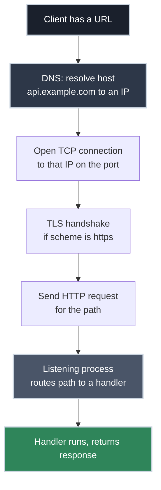

# From URL to Endpoint: How an API Gets Exposed

!!! tip "Part of a Learning Path"
    This article is part of two learning paths on [bradpenney.io](https://bradpenney.io): [How APIs Actually Work](https://bradpenney.io/pathways/how-apis-work) and [Put Your Kubernetes App on the Internet](https://bradpenney.io/pathways/cluster-to-internet). It also stands on its own.

You've been handed a task: "expose an endpoint so the billing team can hit it." You can `curl` endpoints all day, but the word *expose* is doing a lot of quiet work. Expose it where? To whom? What physically has to be true for `https://api.example.com/orders` to reach your code — and what stops the whole internet from reaching it too?

This is the article that turns "expose an endpoint" from a vague instruction into a concrete chain of things you can point at. We'll follow a single URL from the address bar to the line of code that answers it.

## The URL Is a Set of Instructions

A URL isn't one thing — it's several routing instructions packed into one string. Pull `https://api.example.com:443/orders?status=open` apart:

| Part | Value | What it tells the client |
| :--- | :--- | :--- |
| **Scheme** | `https` | Use HTTP over TLS (encrypted) — implies port 443 by default |
| **Host** | `api.example.com` | *Which machine* (the hostname / FQDN) — resolve this name to an IP |
| **Port** | `443` | *Which door* on that machine to knock on |
| **Path** | `/orders` | *Which endpoint* on the server to invoke |
| **Query** | `?status=open` | Parameters for that endpoint |

"Exposing an endpoint" means making every one of these resolve to something real: a name that resolves to an IP, a machine reachable on a port, a process listening on that port, and code that handles that path. Break any link and the endpoint is "down" — and knowing the chain is how you diagnose *which* link broke.

## The Journey of One Request

Here's what happens between pressing Enter and getting JSON back.



Each stage is a thing that can be misconfigured, and each maps to a specific debugging command.

## Stage 1: DNS Turns a Name Into an Address

Computers don't connect to `api.example.com` — they connect to an IP address like `203.0.113.10`. DNS is the lookup that translates one to the other. "Exposing" a name means creating a DNS record that points it at your server's IP.

```bash title="See what a hostname resolves to" linenums="1"
dig +short api.example.com   # (1)!
# 203.0.113.10

nslookup api.example.com     # (2)!
```

1. `dig +short` returns just the resolved IP — the fastest way to confirm a name points where you expect.
2. `nslookup` is the cross-platform equivalent if `dig` isn't installed.

If `dig` returns nothing or the wrong IP, the endpoint will be unreachable no matter how healthy your server is — the client can't even find it. (DNS failures are common enough to be their own debugging topic.)

## Stage 2: The Port Is the Door

An IP address gets you to the *machine*. A single machine can run many services at once — a web API, a database, an SSH daemon — so it needs a way to direct incoming connections to the right one. That's the **port**: a numbered door on the IP.

- `80` — HTTP (unencrypted), the default for `http://`
- `443` — HTTPS (encrypted), the default for `https://`
- `22` — SSH
- `5432` — PostgreSQL, `3306` — MySQL, `6379` — Redis

This is why `https://api.example.com` needs no `:443` — the scheme implies the port. Exposing an API means a process is **listening** on a port *and* the network path to that port is **open**. Two separate conditions, two separate failure modes:

```bash title="Test whether a port is reachable" linenums="1"
nc -zv api.example.com 443   # (1)!
# Connection to api.example.com 443 port [tcp/https] succeeded!

curl -v https://api.example.com/   # (2)!
```

1. `nc` (netcat) tests raw TCP connectivity to a port without sending any HTTP. If this fails but DNS resolved fine, traffic to the port is blocked or nothing is listening.
2. `curl -v` shows the full connect → TLS → request sequence, so you can see exactly how far it gets.

!!! warning "'Listening' and 'reachable' are different"

    A process can be happily listening on port 443 while a firewall or cloud security group silently drops every packet to it. From the client, both look identical: a hang or "connection refused/timed out." Confirm both: is something *listening* (on the server, `ss -tlnp`), and is the port *reachable* (from the client, `nc -zv`)?

## Stage 3: Localhost vs the World — What "Exposed" Really Decides

Here's the part that's secretly a security decision. When a process starts listening, it **binds** to an address, and that choice determines who can reach it:

- **Bind to `127.0.0.1` (localhost)** — only processes *on the same machine* can connect. The endpoint exists but is invisible to the network. This is why your local dev server isn't on the internet.
- **Bind to `0.0.0.0` (all interfaces)** — accept connections from *anywhere* that can route to the machine. This is "exposed to the network."

```bash title="See what's listening, and where it's bound" linenums="1"
sudo ss -tlnp   # (1)!
# State   Local Address:Port
# LISTEN  127.0.0.1:8090      <- localhost only (NOT exposed)
# LISTEN  0.0.0.0:443         <- all interfaces (exposed)
```

1. `ss -tlnp` lists listening TCP sockets with the bound address and owning process. The owning-process column (`-p`) is only populated when you run as root — hence `sudo`; without it that column is blank. The bind address tells you instantly whether a service is private or exposed.

"Expose an endpoint for the billing team" is really a binding-plus-reachability question: should it bind to all interfaces and be reachable on the internet, or bind privately and only be reachable from inside your network? Most internal APIs should *not* be bound to `0.0.0.0` on a public IP — they should sit on a private network or behind a [gateway](../../efficiency/api_gateways/reverse_proxies_and_gateways.md), reachable only by the systems that need them. Getting this wrong is how databases end up exposed to the entire internet.

## Stage 4: The Path Reaches a Handler

Once the connection is open and the request arrives, the listening process reads the **path** (`/orders`) and routes it to the code that handles it — the "endpoint" in the application sense. This is the boundary where networking hands off to your application: the route table maps `/orders` to a function, and that function runs.

So the full meaning of "the `/orders` endpoint is exposed":

1. `api.example.com` **resolves** (DNS) to the server's IP.
2. The server is **reachable** on the port (open firewall/security group).
3. A process is **listening** on that port, bound to an interface clients can reach.
4. That process has a **route** for `/orders` that runs a handler.

Four conditions. When an endpoint is "down," exactly one of them has usually broken — and now you know which command checks each.

## Why This Matters for Platform Work

- **It turns "the API is unreachable" into a four-step checklist.** Resolve the name (`dig`), reach the port (`nc`), confirm something's listening (`ss`), then check the application route. You stop guessing and start bisecting.
- **It's the difference between a private and an exposed service.** The bind address and firewall rules — not the application code — decide whether the billing team or the entire internet can reach your endpoint.
- **It frames where a gateway fits.** Most production APIs aren't exposed directly; they bind privately and a [reverse proxy or API gateway](../../efficiency/api_gateways/reverse_proxies_and_gateways.md) is the only thing bound to the public port. Understanding direct exposure first makes the gateway's job obvious.

## Common Scenarios

=== ":material-magnify: 'Connection refused' immediately"

    The client reached the machine, but **nothing is listening** on that port (or the process crashed). DNS and routing are fine. Check on the server with `ss -tlnp` — is your process actually up and bound to the expected port? "Refused" is fast and definite, which distinguishes it from a firewall *timeout*.

=== ":material-timer-sand: Connection hangs, then times out"

    Packets are being **silently dropped** — almost always a firewall or cloud security group with no rule allowing the port. The server never gets a chance to refuse. Check the security group / `iptables` rules for an allow rule on the port. A timeout (vs an instant refusal) is the signature of a firewall.

=== ":material-home: 'Works on the server but not remotely'"

    `curl localhost:8080` works when you SSH in, but remote clients can't connect. The service is bound to **`127.0.0.1`**, not `0.0.0.0` — it's listening for local connections only. Confirm with `ss -tlnp` and rebind to an appropriate interface (or, better, front it with a gateway rather than exposing it directly).

## Practice Problems

??? question "Practice Problem 1: Which Link Broke?"

    `curl https://api.example.com/health` hangs and eventually times out. `dig +short api.example.com` returns a valid IP. What's the most likely cause, and what do you check next?

    ??? tip "Solution"

        DNS works (you got an IP), so the break is *after* name resolution. A **hang-then-timeout** (rather than an instant "connection refused") is the classic signature of packets being **dropped by a firewall or security group** — no rule allows the port. Next step: `nc -zv api.example.com 443` to confirm the port is unreachable, then inspect the firewall / cloud security group for a missing allow rule on 443. (If `nc` *succeeds*, the problem moves up to TLS or the app.)

??? question "Practice Problem 2: Accidentally Private"

    A teammate deployed a new API. `dig` resolves, the security group allows 8080, but remote `curl` gets "connection refused" while `curl localhost:8080` on the server works fine. What happened?

    ??? tip "Solution"

        The service is **bound to `127.0.0.1`** instead of `0.0.0.0`. It's listening only for connections originating on the same machine, so local `curl` works but remote clients are refused. Confirm with `ss -tlnp` — you'll see `127.0.0.1:8080`. The fix is to bind to an interface remote clients can reach (or, preferably, keep it bound privately and put a reverse proxy in front). "Connection refused" with everything else healthy points at the bind address.

??? question "Practice Problem 3: Why No Port in the URL?"

    A junior engineer asks why `https://api.example.com/orders` works without a port number, but the internal tool at `http://10.0.0.5:8080/health` needs one. Explain.

    ??? tip "Solution"

        The **scheme implies a default port**: `https` defaults to 443 and `http` to 80, so the client connects there automatically when no port is given. The public API listens on the standard 443, so the port can be omitted. The internal tool listens on a **non-standard** port (8080), which no scheme implies, so it must be stated explicitly. The port is always part of the connection — it's just hidden when it matches the scheme's default.

## Key Takeaways

| Concept | What It Means |
| :--- | :--- |
| **URL = instructions** | Scheme, host, port, path each route the request one step further |
| **DNS** | Resolves the host name to an IP; first thing to verify (`dig`) |
| **Port** | The numbered door on the IP; 80=HTTP, 443=HTTPS (`nc -zv` to test) |
| **Listening ≠ reachable** | A process can listen while a firewall drops all traffic to it |
| **Bind address** | `127.0.0.1` = local only; `0.0.0.0` = exposed to the network (`ss -tlnp`) |
| **Exposed endpoint** | DNS resolves + port reachable + process listening + route handles the path |

"Expose an endpoint" stops being intimidating once you can see the chain it really means: a name that resolves, a port that's reachable, a process that's listening on the right interface, and a route that handles the path. Each link has a command that proves it's working — so the next time someone says an API is unreachable, you won't guess. You'll bisect the chain and find the one link that broke.

## Further Reading

### Related Networking Articles

- **[How DNS Actually Works](../dns/how_dns_works.md)** — what's really inside stage 1: the resolution chain, records, and TTLs.
- **[HTTPS for APIs: Where the Connection Gets Secured](../tls/https_for_apis.md)** — what the TLS handshake (stage 3) actually does.
- **[Reverse Proxies and API Gateways](../../efficiency/api_gateways/reverse_proxies_and_gateways.md)** — why production endpoints are exposed *through* a front door, not directly.

### Computer Science Fundamentals

- **[Client and Server: The Request/Response Lifecycle](https://cs.bradpenney.io/efficiency/web/client_server_request_response/)** — the conceptual model of who initiates and who responds.
- **[Network Fundamentals (cs.bradpenney.io)](https://cs.bradpenney.io/)** — LANs, WANs, IP, and TCP underneath all of this.

### External Resources

- [MDN: What is a URL?](https://developer.mozilla.org/en-US/docs/Learn_web_development/Howto/Web_mechanics/What_is_a_URL) — every part of a URL, explained.
- [Cloudflare: What is DNS?](https://www.cloudflare.com/learning/dns/what-is-dns/) — the name-resolution step in depth.
