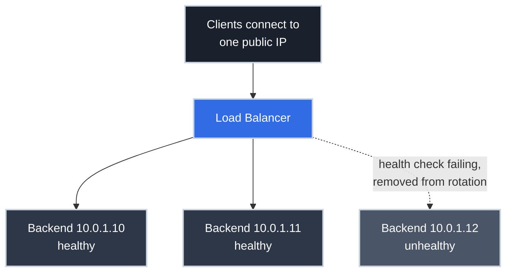

# Load Balancer Basics: One Address, Many Healthy Servers

!!! tip "Part of a Learning Path"
    This article is part of the [Put Your Kubernetes App on the Internet](https://bradpenney.io/pathways/cluster-to-internet) pathway on [bradpenney.io](https://bradpenney.io) — a guided sequence through the topic. It also stands on its own.

One request in three fails. Refresh — fine. Refresh — fine. Refresh — error page. Your app runs on three servers behind a load balancer, one of them is quietly broken, and the load balancer is still cheerfully sending it every third request. Nothing in *your* logs explains it, because the failing server isn't writing logs at all.

This article is about the machine in front of your machines, and it's organized around the one idea that makes every load balancer legible: **a load balancer is two decisions, repeated forever: *who's healthy*, and *who's next*.** We'll establish what the machine is and which of two very different kinds you're looking at, then take each decision apart. Hold onto the broken-server incident above; by the end, you'll know exactly which decision failed and why.

## One Address, Many Servers

[DNS hands out one answer](../dns/how_dns_works.md): a name resolves to an IP address. But a single server has a ceiling: one machine can only take so much traffic, and when it dies, everything dies with it. The moment you run a second server, you have a problem DNS can't cleanly solve: **one public address has to fan out to many private machines**.

A **load balancer** is the machine that owns that public address. Clients connect to it; it forwards each connection or request to one of the backend servers, and it *stops* forwarding to backends that fail. That's the two-decision loop in its natural habitat:

- ***Who's healthy?*** — notice a dead backend and route around it, in seconds, without anyone updating anything.
- ***Who's next?*** — spread the traffic so no backend drowns while others idle.



!!! tip "Why not just put every server's IP in DNS?"
    You can — it's called DNS round-robin, and resolvers will rotate through the answers. But remember [how DNS caching works](../dns/how_dns_works.md): once a client caches a dead server's IP, it keeps using it until the TTL expires. There's no health checking and no fast failover; a removed record lingers in caches for minutes or hours. A load balancer reacts to a dead backend in seconds, behind an address that never changes. DNS gets clients to the front door; the load balancer handles everything after it.

In practice you rarely rack-mount this machine yourself. It's a managed cloud load balancer (AWS ELB, GCP Cloud Load Balancing), a software proxy you run (HAProxy, Traefik, NGINX), or something an orchestrator like Kubernetes provisions for you. But before you can reason about any of them (or make sense of a cloud pricing page), you have to know which of two very different machines is wearing the name.

## Two Kinds of Load Balancer: L4 vs L7

Start with a fact the name does its best to hide: **"load balancer" is not one kind of machine — it's two.** The industry sells them as distinct products and runs them in distinct modes: AWS offers a *Network* Load Balancer and an *Application* Load Balancer as separate services, HAProxy runs in either `tcp` mode or `http` mode, and clouds price and deploy them differently. Pick the wrong kind, and features you assumed every load balancer has (routing by URL path, cookie-based stickiness) simply don't exist on the box you bought.

What splits them is *how deep into the traffic* each one looks. Network traffic is built in layers, like a letter inside an envelope: the **transport layer** (*Layer 4*, TCP or UDP) is the envelope, carrying just addresses, ports, and the connection itself, with no idea what's being said. The **application layer** (*Layer 7*, HTTP for the web) is the letter inside: URLs, headers, cookies, the actual request. (The numbering comes from the classic OSI model of the network stack; 4 and 7 are the two layers you'll hear named in daily work.)

An **L4 load balancer** reads only the envelope; an **L7 load balancer** opens it and reads the letter. That single design choice decides everything each can and cannot do:

| | **Layer 4 (transport)** | **Layer 7 (application)** |
| :--- | :--- | :--- |
| **Sees** | IPs, ports, TCP/UDP connections | Full HTTP requests: paths, headers, cookies, methods |
| **Balances** | Connections — every packet of a connection goes to the same backend | Individual requests — two requests on one connection can go to different backends |
| **Can route on** | Destination port, source IP | `Host` header, URL path, cookies, anything in the request |
| **TLS** | Usually passes encrypted traffic through untouched | Usually terminates TLS so it can read the request |
| **Speed** | Faster; it's moving packets, not parsing HTTP | Slower per request, vastly more capable |
| **Examples** | AWS NLB, HAProxy in TCP mode, `IPVS` | AWS ALB, Traefik, NGINX, HAProxy in HTTP mode |

The rule of thumb: **L4 moves connections; L7 understands requests.** Balancing PostgreSQL or raw TCP? That's L4: there's no HTTP to inspect. Sending `/api` to one pool and `/static` to another, or routing by hostname? That requires reading the request, so it's L7.

An L7 load balancer *is* a [reverse proxy](../../efficiency/api_gateways/reverse_proxies_and_gateways.md): the front-door pattern you may already know, viewed through its traffic-distribution job. And the two layers routinely *stack* in real systems (in Kubernetes, an L4 balancer gets traffic to the cluster while an L7 router dispatches it inside), so knowing which layer you're debugging is half the diagnosis.

Whichever kind fronts your app, though, its day job is the same two-decision loop, and everything from here on is those two decisions, taken apart one at a time.

## Decision One — Who's Healthy: Health Checks

This is the decision that failed in the opening incident, and it rests entirely on **health checks**: the load balancer probes each backend on an interval, and backends that fail get pulled from rotation until they pass again.

The design question is *how deep the probe goes*, and both extremes hurt:

- **Too shallow** — "is the TCP port open?" A process can accept connections while returning errors on every real request. That's the opening incident solved: the broken server still had its port open, so a shallow check kept it in rotation, and round-robin dutifully sent it every third request. Port-open checks tell you the process exists, not that it works.
- **Reasonable** — an HTTP probe of a dedicated endpoint (`/health`, `/readyz`) that returns `200` when the app can actually serve: it's warmed up, its config loaded, its critical dependencies reachable.
- **Too deep** — a health check that exercises the database on every probe. Now a brief database hiccup fails *every* backend's health check simultaneously, the balancer pulls all of them, and a 2-second blip becomes a full outage: **no healthy targets**. Your health check just amplified a wobble into a `503`.

```bash title="Check what the balancer checks" linenums="1"
curl -v http://10.0.1.12:8080/health   # (1)!

curl -I https://api.example.com        # (2)!
```

1. Probe a backend directly, from inside the network, using the same path the balancer probes — this shows you what the *balancer* sees, bypassing it entirely.
2. Then compare with the response through the public address. When these two disagree, the story is in the balancer: rotation state, health-check config, or timeouts.

The failure mode worth memorizing: **"all targets healthy" plus failing users means the health check is testing the wrong thing.** The check passes, the real requests don't, and the dashboard gaslights you. Reading *what the probe actually requests* (path, expected status, interval, failure threshold) is step one of any load balancer incident.

## Decision Two — Who's Next: Algorithms

Decision one produced a healthy set. Now, for every incoming connection (L4) or request (L7), the balancer picks one member of that set using an **algorithm**:

| Algorithm | How it picks | Reach for it when |
| :--- | :--- | :--- |
| **Round robin** | Each backend in turn, 1-2-3-1-2-3 | Requests are short and uniform — the default, and usually fine |
| **Weighted round robin** | In turn, but bigger servers get more turns | Backends have unequal capacity (mixed instance sizes, canary getting 5%) |
| **Least connections** | Whoever has the fewest open connections | Request durations vary a lot — uploads, reports, long polls |
| **IP hash** | Same client IP → same backend, deterministically | You need affinity without cookies (see below) |

Round robin's weakness is that it counts *requests*, not *work*: if one backend gets stuck chewing on slow requests, round robin keeps feeding it at the same rate anyway. Least connections uses open-connection count as a live proxy for "who's busiest," which is why it wins when request cost is uneven.

### Sticky Sessions: Convenient, and a Trap

One application habit quietly sabotages the who's-next decision: keeping session state in server memory. Log in on backend 2, and only backend 2 knows you, so now the balancer *can't* freely pick, and **sticky sessions** (session affinity) formalize the constraint: send each client back to "their" backend, via a cookie (L7) or IP hash (L4).

It works, but you pay twice. Load skews: a handful of heavy clients pinned to one backend can drive it to 90% while its neighbors idle, and the balancer *can't* rebalance them — that's the whole point of stickiness. And failover hurts: when a backend dies, every session pinned to it evaporates. The durable fix isn't better stickiness, it's [statelessness](https://cs.bradpenney.io/efficiency/web/http_statelessness/): keep session state out of server memory (in a shared store), and any backend can serve any request. Stateless backends are also exactly what lets an orchestrator treat your app's replicas as interchangeable.

## Why This Matters for Platform Work

- **Most "load balancer work" is health-check work.** You'll rarely choose an algorithm twice a year, but you'll tune probe paths, thresholds, and timeouts constantly, and most LB-shaped incidents trace back to a probe that's too shallow, too deep, or too slow to react.
- **L4 vs L7 is load-bearing vocabulary.** Cloud pricing pages, Kubernetes docs, and architecture reviews all assume you know which layer is being discussed. "Can we route on the path?" is a one-word answer once you know the layer.
- **The balancer is where "is it us or them?" gets answered.** Probing a backend directly and comparing with the public address splits every incident into *backend problem* or *balancer problem* in two commands.

## Common Scenarios

=== ":material-repeat: 'Every third request fails'"

    A rotation is including a broken backend: round robin plus one dead server out of three produces exactly this rhythm. The health check is passing on a backend that can't serve (usually a port-open check on a wedged process). Probe each backend directly on the health-check path; the fix is a deeper probe, not a restart loop.

=== ":material-scale-unbalanced: 'One backend at 90%, four idle'"

    Traffic isn't being distributed — it's being *pinned*. Sticky sessions (or IP hash behind a corporate NAT, where thousands of users share one source IP) are concentrating clients onto one backend. Check for affinity cookies and hash-based algorithms before blaming the backend.

=== ":material-cancel: 'Everything is 503, all at once'"

    `503` from the balancer means **no healthy targets**: every backend is out of rotation simultaneously. Either a deploy really did take them all down, or (subtler) a shared dependency hiccuped and an over-deep health check failed the whole fleet in one probe interval. If the backends look fine but the balancer disagrees, read the health-check config first. For decoding the rest of the `5xx` family the front door returns, see [Reverse Proxies and API Gateways](../../efficiency/api_gateways/reverse_proxies_and_gateways.md).

## Practice Problems

??? question "Practice Problem 1: How Deep Should /health Go?"

    A teammate proposes that `/health` should run `SELECT 1` against the database, reasoning "if the DB is down, the server can't serve, so it *should* fail health checks." What's the counter-argument?

    ??? tip "Solution"

        Every backend shares that database — so a brief DB hiccup fails **all** health checks in the same probe window, the balancer pulls **every** backend, and a 2-second wobble becomes a fleet-wide `503` outage (plus a thundering herd when they all return at once). Worse, removing backends does nothing to fix a *database* problem; the health check punishes the wrong component. Better: `/health` verifies the app itself is up and serving; dependency failures surface as request errors and alerts on the *dependency*, not as mass ejection of healthy web servers. (Deep checks have a place, at startup before a backend first enters rotation, which is exactly the distinction Kubernetes formalizes with readiness probes.)

??? question "Practice Problem 2: Which Layer Do You Need?"

    Three requirements land on your desk: (a) balance connections to a PostgreSQL replica pool; (b) send `api.example.com/v2/*` to the new backend pool and everything else to the old one; (c) balance WebSocket connections that stay open for hours. Which layer does each need, and which algorithm suits (c)?

    ??? tip "Solution"

        (a) **L4**: PostgreSQL isn't HTTP; there's nothing for L7 to parse. (b) **L7**: routing on a URL path requires reading the request. (c) **L4 or L7 both work** (WebSockets start as HTTP then become a long-lived connection), but the algorithm matters more than the layer: **least connections**. Round robin counts connection *starts*, and with hours-long connections it will happily stack new ones onto a backend already holding hundreds while a freshly restarted backend sits nearly empty.

??? question "Practice Problem 3: The Slow Failover"

    Before adopting a load balancer, your team ran two servers with both IPs in a DNS round-robin record (TTL 3600). When one server died, users saw errors for up to an hour even after the team removed its IP from DNS within minutes. Why — and what specifically does a load balancer change?

    ??? tip "Solution"

        Resolvers worldwide cached the two-IP answer and are allowed to serve it for the full TTL — 3600 seconds. Removing the record changes the authoritative answer, but caches don't re-ask until their copy expires, so roughly half of cached lookups kept steering users to the dead IP for up to an hour. A load balancer moves failover *behind* a stable address: DNS always points at the balancer's IP (nothing to change, nothing to expire), and health checks pull the dead backend from rotation in seconds. Failure handling moves from a caching system you don't control to one you do.

## Key Takeaways

| Concept | What It Means |
| :--- | :--- |
| **One address, many servers** | The balancer owns the public IP; backends stay private and interchangeable |
| **The two decisions** | *Who's healthy* (health checks) and *who's next* (algorithms) — repeated forever |
| **DNS round-robin ≠ LB** | Caches serve dead IPs until the TTL expires; balancers react in seconds |
| **Two kinds of LB** | L4 and L7 are different machines: L4 moves connections; L7 reads requests and routes on path/host/cookie |
| **Health check depth** | Too shallow keeps broken backends in; too deep ejects the whole fleet at once |
| **Least connections** | The algorithm for long or uneven requests; round robin for short, uniform ones |
| **Sticky sessions** | Affinity trades load skew and painful failover for in-memory session state |

Two decisions, repeated forever — and now you've seen how each one is made, tuned, and broken: probes too shallow or too deep for *who's healthy*, algorithms and stickiness for *who's next*, and the L4/L7 split deciding what the machine can even see. That frame is portable: wherever you meet a load balancer (a cloud console, an HAProxy config, the machinery an orchestrator builds for you), start by asking which kind it is, then interrogate its two decisions.

## Further Reading

### Related Networking Articles

- **[How DNS Actually Works](../dns/how_dns_works.md)** — how clients find the balancer's address, and why DNS caching makes it a poor substitute for one.
- **[Reverse Proxies and API Gateways, Demystified](../../efficiency/api_gateways/reverse_proxies_and_gateways.md)** — the L7 front door's other jobs: TLS termination, routing, auth, and reading `502`/`504`.
- **[From URL to Endpoint](../http/from_url_to_endpoint.md)** — the full journey a request takes before the balancer ever sees it.

### Computer Science Fundamentals

- **[Why HTTP APIs Forget You: Statelessness (cs.bradpenney.io)](https://cs.bradpenney.io/efficiency/web/http_statelessness/)** — the property that makes backends interchangeable and sticky sessions unnecessary.

### External Resources

- [HAProxy documentation](https://www.haproxy.org/#docs) — the classic software load balancer; its docs are a free education in the field.
- [Cloudflare: What is load balancing?](https://www.cloudflare.com/learning/performance/what-is-load-balancing/) — a clear illustrated overview.
- [AWS Elastic Load Balancing documentation](https://docs.aws.amazon.com/elasticloadbalancing/) — how the L4/L7 split shows up in a real cloud (NLB vs ALB).
