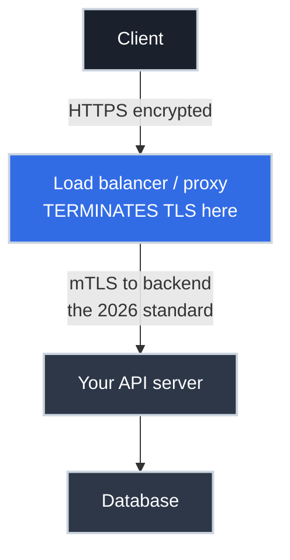
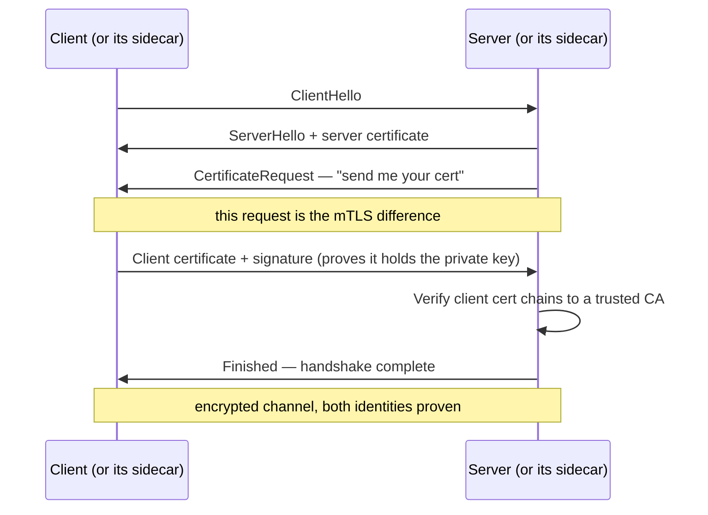

# HTTPS for APIs: Where the Connection Gets Secured

!!! tip "Part of a Learning Path"
    This article is part of the [How APIs Actually Work](https://bradpenney.io/pathways/how-apis-work) pathway on [bradpenney.io](https://bradpenney.io) — a guided sequence through the topic. It also stands on its own.

You put `https://` in front of your API and call it secured. And mostly, it is — but "secured" hides a question that matters enormously the moment you're designing the system: **where, physically, does the encryption stop?** Because it almost never stops where people assume, and that gap is the difference between an API that's actually private and one that quietly ships sensitive data in the clear inside your own network.

This article is about that question. It assumes you've seen [how an endpoint gets exposed](../http/from_url_to_endpoint.md) — here we add the lock to the door. We won't re-explain the *base* TLS handshake; we'll focus on what HTTPS means *for an API*, where it terminates, and the mutual-TLS handshake that's become the standard for securing every hop behind the edge.

## What HTTPS Actually Protects (and What It Doesn't)

HTTPS is HTTP carried inside a TLS-encrypted connection. It gives you three guarantees **while data is in transit**:

- **Confidentiality** — eavesdroppers on the network can't read the request or response.
- **Integrity** — the data can't be tampered with en route without detection.
- **Authenticity** — the certificate proves you're talking to the real server, not an impostor (the chain of trust).

What HTTPS does **not** do is just as important to internalize:

- It does **not** authenticate the *caller*. HTTPS proves the server's identity to the client, not the other way around. Knowing *who is calling* is [authentication](https://cs.bradpenney.io/efficiency/web/authentication_vs_authorization/), a separate layer that rides *inside* the encrypted channel.
- It does **not** protect data **at rest** or **after** the connection terminates. The instant TLS is decrypted, the data is plaintext again — and that instant is the whole story of this article.

!!! warning "HTTPS secures the pipe, not the payload's whole life"

    A common and dangerous assumption is "we use HTTPS, so the data is encrypted end to end." HTTPS encrypts data *between two endpoints of a connection*. If there are multiple hops (and in production there always are), each hop is its own connection that may or may not be encrypted. The lock on the address bar says nothing about what happens after the first hop.

## TLS Termination: The Concept That Changes Everything

**TLS termination** is the point where the encrypted connection is decrypted back into plain HTTP. Whatever component does the decryption is said to "terminate TLS." In a real system, that's rarely your application — and that's by design.

Consider the most common production setup. The client opens an HTTPS connection, but it doesn't reach your app directly. It reaches a [reverse proxy or load balancer](../../efficiency/api_gateways/reverse_proxies_and_gateways.md) at the edge, which **terminates TLS** and forwards the now-decrypted request onward.



Why terminate at the edge instead of in the app?

- **Certificate management in one place.** The proxy holds and renews the certificate; your dozen backend services don't each need one. (Renewal automation is its own discipline.)
- **Performance.** The encryption/decryption work is handled by infrastructure built for it, freeing your app.
- **Routing and inspection.** The proxy can read the (now plaintext) request to route, rate-limit, and log it — it can't do that while it's encrypted.

The catch: **after termination, that forwarded request is plaintext unless you secure the hop behind it** — and in 2026 there's a clear standard for how.

## The Backend Hop: mTLS Is the Standard

Edge termination handles the *client* leg. It says nothing about the hop **after** it — proxy to backend, service to service — and that hop is where production practice has moved decisively. **Zero-trust is the baseline now: no network is assumed safe, internal or not, so every hop is encrypted *and* every caller is authenticated. That is mutual TLS.** The older patterns still turn up in the wild, but they're debt, not designs.

=== ":material-shield-lock: Mutual TLS (mTLS) — the standard"

    Both ends present certificates: the client verifies the server *and* the server verifies the client. Every hop is encrypted, and every caller is cryptographically identified.

    - **This is the production default.** Zero-trust assumes the internal network is hostile, so a service proves who it is on *every* call. Service meshes (Istio, Linkerd) and SPIFFE/SPIRE issue and rotate per-workload certificates automatically — mTLS is now the *path of least resistance*, not the hard road.
    - **The connection itself becomes identity.** A stolen bearer token is far less useful without a valid client certificate, and a compromised host can't impersonate a service whose cert it doesn't hold.
    - **The cost is operational, not architectural** — issuance and rotation — and a mesh absorbs most of it. "mTLS is too heavy" was a fair objection a decade ago; the tooling closed that gap.

=== ":material-lan-connect: One-way re-encryption — legacy"

    The proxy terminates the client's TLS, then opens a **new**, server-authenticated TLS connection to the backend. Both legs are encrypted — but the backend still can't verify *who* is calling.

    - **Where you'll meet it:** estates that encrypted the wire before caller identity became table stakes. It protects the data, not the identity — it stops half-way.
    - **Treat it as a migration source, not a destination.** You're already running TLS on the internal hop; adding client certificates to reach mTLS is a short step. Take it.

=== ":material-lan-disconnect: Edge termination to plaintext — insecure"

    TLS is decrypted at the proxy and traffic to the backend is **plain HTTP**. Tokens, payloads, everything travels readable on the internal network.

    - **Why it persists:** it's the quickest to stand up, and "the internal network is trusted" once *felt* true. It isn't — one compromised host, a misconfigured port mirror, or a malicious insider reads all of it.
    - **Not production-ready.** "Isolated internal network" is an assumption, not a security control, and it fails the first time it's tested. If you find this, it's a finding to remediate — not a design to defend.

There is no neutral "pick what fits your situation" here anymore. **mTLS is the bar; one-way re-encryption is a way-station on the road to it; plaintext behind the edge is an item in your next audit.** Design for mTLS and treat anything less as something you're actively migrating away from.

## How mTLS Actually Works

Ordinary ("one-way") TLS authenticates one side: the server. mTLS adds a second, symmetric step so **both** ends prove their identity with certificates. It's the same handshake you already rely on, plus one exchange.

### The one addition: the client proves itself too

In ordinary HTTPS the server holds a certificate, the client verifies it against the chain of trust, and identity stops there — the server never learns who the client is. mTLS closes that gap: **the server also demands a certificate from the client and verifies it against a CA it trusts.**



Walking the steps:

1. **ClientHello / ServerHello** — the two agree on a TLS version and cipher. The ClientHello also carries **SNI** (Server Name Indication): the hostname the client wants, sent in the clear, so a gateway fronting many domains knows which certificate to present before the handshake completes.
2. **Server certificate** — the server presents its cert; the client verifies it against its trusted CA(s). *(This is all one-way TLS does.)*
3. **CertificateRequest** — the mTLS part: the server asks the client for a certificate, naming the CA(s) it will accept.
4. **Client certificate + proof** — the client sends its cert **and signs part of the handshake with its private key**, proving it actually holds the key rather than replaying a copied cert.
5. **Server verifies the client** — the server confirms the client cert chains to a CA it trusts and that the signature is valid. Only then does the handshake finish.
6. **Mutually-authenticated channel** — both sides now know exactly who they're talking to, and everything after is encrypted.

The load-bearing idea: **a certificate alone isn't proof — the private-key signature in step 4 is.** A leaked public certificate is useless without the matching private key, and that key never leaves the workload.

### Who issues the certificates: the internal PKI

mTLS only works if both ends trust a common issuer. That's *not* the public web CAs — it's an **internal CA** dedicated to your services. Each workload gets its own certificate identifying it (often a [SPIFFE](https://spiffe.io/) ID like `spiffe://cluster.local/ns/payments/sa/api`), and those certs are deliberately **short-lived** — hours, not years. Short lifetimes mean a stolen key expires almost immediately and you sidestep the whole certificate-revocation-list problem.

### Why a service mesh makes this practical

Hand-managing a cert per service — issuing, distributing, rotating before expiry — is the reason mTLS *used* to be "too much work." A service mesh removes that work entirely:

- A **sidecar proxy** (Envoy) runs beside each service and performs the mTLS handshake on its behalf. Your application speaks plain HTTP to its *own* sidecar and never sees a certificate.
- A **control plane** (Istio, Linkerd, or SPIFFE/SPIRE) is the internal CA: it mints per-workload certs, pushes them to the sidecars, and rotates them automatically — often every few hours.

The result is mTLS on every hop with no certificates in your application code and no manual rotation. That automation is precisely why mTLS moved from "advanced" to "default."

A full mesh isn't the only way to get there. For a single service — or anywhere you don't want to run a mesh — a **sidecar auth proxy** can terminate mTLS in front of your app and hand it plain HTTP, the same separation a mesh provides at smaller scale. [forevd](https://github.com/firestoned/forevd) is one such proxy: it terminates mTLS (and can add OIDC and group/user authorization on top), so the application never touches a certificate.

!!! info "Disclosure"
    I contribute to forevd, mentioned here as one example of the sidecar pattern — not an endorsement.

```bash title="Complete an mTLS handshake by hand" linenums="1"
# Without a client cert, an mTLS endpoint rejects the handshake:
openssl s_client -connect api.internal:443 </dev/null          # (1)!

# Present the client cert + key to satisfy the CertificateRequest:
openssl s_client -connect api.internal:443 \
  -cert client.crt -key client.key \
  -CAfile internal-ca.crt </dev/null                            # (2)!
```

1. The server sends a `CertificateRequest`; offering no client cert aborts the handshake with an alert like `tlsv13 alert certificate required`. That rejection *is* mTLS doing its job.
2. `-cert`/`-key` present the client's identity (and prove possession of the key); `-CAfile` is the internal CA used to verify the *server*. A clean handshake means both directions checked out.

## Quick Start: See Where TLS Terminates

You can inspect the encrypted side from any client. The trickier question — *what happens after termination* — you confirm from inside the network.

```bash title="Inspect the client-facing TLS" linenums="1"
# What certificate is presented, and by whom?
echo | openssl s_client -connect api.example.com:443 2>/dev/null \
  | openssl x509 -noout -subject -issuer -dates   # (1)!

# Watch curl negotiate TLS, then send the request
curl -v https://api.example.com/health            # (2)!

# Confirm HTTP is redirected to HTTPS (it should be)
curl -sI http://api.example.com/ | grep -i location   # (3)!
```

1. Shows the subject (who the cert is for), issuer (the CA), and validity dates — often revealing it's the *load balancer's* cert, not the app's, which is your first clue that the edge terminates TLS.
2. The verbose handshake shows the negotiated TLS version and cipher before any HTTP is sent.
3. A well-configured API redirects plain `http://` to `https://` so nothing is ever sent unencrypted by mistake.

## Why This Matters for Platform Work

- **"We use HTTPS" is an incomplete answer to "is the API secure in transit?"** The real answer depends on where TLS terminates and what happens on the hops *after* it. If a token travels plaintext from the load balancer to the app across a shared network, an attacker on that network has it.
- **Certificates usually live at the termination point.** When TLS breaks ("certificate expired," "hostname mismatch"), the fix is almost always at the proxy/load balancer that terminates it, not in your application — knowing this saves you debugging the wrong layer.
- **Behind the edge, mTLS is the baseline — not an upgrade.** Zero-trust assumes the internal network is hostile, so the production standard is mutual TLS on every hop: encrypted *and* caller-authenticated. A plaintext internal hop isn't a "trade-off made on purpose," it's debt that surfaces as an audit finding; one-way re-encryption is only a stop on the way to mTLS.

## Common Scenarios

=== ":material-alert: 'Certificate expired' but the app is fine"

    The app server is healthy, but clients get TLS errors. The certificate lives at the **termination point** (load balancer / proxy / CDN), and *that's* what expired. Renewing it on the app server does nothing. Identify what terminates TLS (the `openssl s_client` issuer/subject is a hint), and fix the cert there. Automate renewal so it never recurs.

=== ":material-eye: A token leaked on the internal network"

    Traffic was sniffed *inside* the VPC and bearer tokens were visible. The edge terminated TLS and forwarded **plaintext** over a network that was never as isolated as assumed. The fix is the standard: **mTLS on the backend hop**, so every internal call is encrypted *and* the caller is authenticated — a sniffed token alone then buys an attacker nothing. One-way re-encryption removes the plaintext but not the impersonation risk, so it's a stopgap at best. Treat every "internal" network as hostile.

=== ":material-swap-vertical: Redirect loop after adding a proxy"

    After putting a TLS-terminating proxy in front, the app keeps redirecting `http`→`https` in a loop. The proxy speaks plain HTTP to the app, so the app thinks the request is insecure and redirects — forever. The fix is the `X-Forwarded-Proto` header: the proxy tells the app "the *original* request was HTTPS," so the app stops redirecting. This header existing at all is a direct consequence of termination happening upstream.

## Practice Problems

??? question "Practice Problem 1: Where's the Certificate?"

    Clients of `https://api.example.com` suddenly get "certificate has expired," but your application servers were redeployed last week with fresh configs and the app logs look healthy. Where do you look?

    ??? tip "Solution"

        At whatever **terminates TLS** — almost certainly a load balancer, reverse proxy, or CDN in front of your app, not the app itself. In a typical setup the client's TLS connection never reaches your application; the edge presents the certificate. Redeploying the app can't fix a cert it doesn't serve. Run `echo | openssl s_client -connect api.example.com:443 | openssl x509 -noout -issuer -subject` to see whose certificate is presented, then renew it at the termination point (and automate renewal).

??? question "Practice Problem 2: Is the Token Safe?"

    Your architecture is: client → (HTTPS) → load balancer → (HTTP) → API → (HTTP) → database, all inside a cloud VPC. A reviewer flags that bearer tokens might be exposed. Are they right, and what changes?

    ??? tip "Solution"

        They're right to flag it. TLS **terminates at the load balancer**, so from there inward the token travels as **plaintext** over the internal network. Anyone able to capture traffic in the VPC (a compromised host, a misconfigured mirror, a malicious insider) can read it — and "internal" is not the same as "encrypted." The architecture shown is **legacy**: the standard is **mTLS for service-to-service**, so every internal hop is encrypted *and* each side authenticates the other, leaving no plaintext leg and no anonymous caller. One-way re-encryption (TLS from LB to API) removes the plaintext but still can't tell the API *who* is calling, so it's a stopgap on the way to mTLS, not the goal.

??? question "Practice Problem 3: HTTPS Is Not Authentication"

    A teammate argues, "Our API is over HTTPS, so we know requests come from trusted clients." Why is this wrong?

    ??? tip "Solution"

        HTTPS authenticates the **server to the client** (via the certificate) and encrypts the channel — it says nothing about *who the client is*. Any client on the internet can open a valid HTTPS connection to your public API. Knowing the caller's identity requires [authentication](https://cs.bradpenney.io/efficiency/web/authentication_vs_authorization/) *inside* the encrypted channel (an API key, token, or — at the TLS layer — **mTLS**, the production standard for service-to-service traffic, which authenticates the client too). HTTPS protects the conversation; it doesn't vouch for who started it.

## Key Takeaways

| Concept | What It Means |
| :--- | :--- |
| **HTTPS = HTTP over TLS** | Confidentiality, integrity, server authenticity — *in transit only* |
| **Not caller auth** | HTTPS proves the *server*; identifying the *client* is a separate layer |
| **TLS termination** | The point where the client's encryption is decrypted — usually the edge, not your app |
| **mTLS is the standard** | The baseline behind the edge: every hop encrypted *and* every caller authenticated (zero-trust; a mesh automates it) |
| **One-way re-encryption** | Encrypts the internal hop but doesn't authenticate the caller — a stopgap on the way to mTLS |
| **Edge-to-plaintext** | Legacy and insecure: readable tokens on the internal network — a finding to remediate, not a design |
| **Certs live at termination** | TLS errors are fixed at the proxy/LB, not the application |

"Put it behind HTTPS" is the start of securing an API in transit, not the end. The question that actually matters is *where the lock comes off* — and then what guards every hop after it. In 2026 the answer isn't "trust the internal network"; it's **mTLS on every hop**, encrypted and mutually authenticated, so no leg is readable and no caller is anonymous. Know your termination point, hold mTLS as the baseline behind it, and "is this secure in transit?" becomes a question you can answer precisely instead of hopefully.

## Further Reading

### Related Networking Articles

- **[TLS Basics: Certificates, Handshakes, and the Chain of Trust](tls_basics.md)** — the handshake and the chain of trust this builds on.
- **[Automating TLS Certificates: ACME and cert-manager](../../efficiency/tls/certificate_management.md)** — automating renewal so termination points never expire.
- **[From URL to Endpoint](../http/from_url_to_endpoint.md)** — how the connection reaches the server in the first place.
- **[Reverse Proxies and API Gateways](../../efficiency/api_gateways/reverse_proxies_and_gateways.md)** — the component that usually terminates TLS.

### Computer Science Fundamentals

- **[Authentication vs Authorization (cs.bradpenney.io)](https://cs.bradpenney.io/efficiency/web/authentication_vs_authorization/)** — the caller-identity layer HTTPS doesn't provide.

### External Resources

- [Cloudflare: What is HTTPS?](https://www.cloudflare.com/learning/ssl/what-is-https/) — a clear conceptual overview.
- [Cloudflare: What is SSL/TLS termination?](https://www.cloudflare.com/learning/ssl/what-is-ssl-termination/) — termination in depth.
- [MDN: HTTP Strict-Transport-Security](https://developer.mozilla.org/en-US/docs/Web/HTTP/Reference/Headers/Strict-Transport-Security) — forcing HTTPS for every request.
