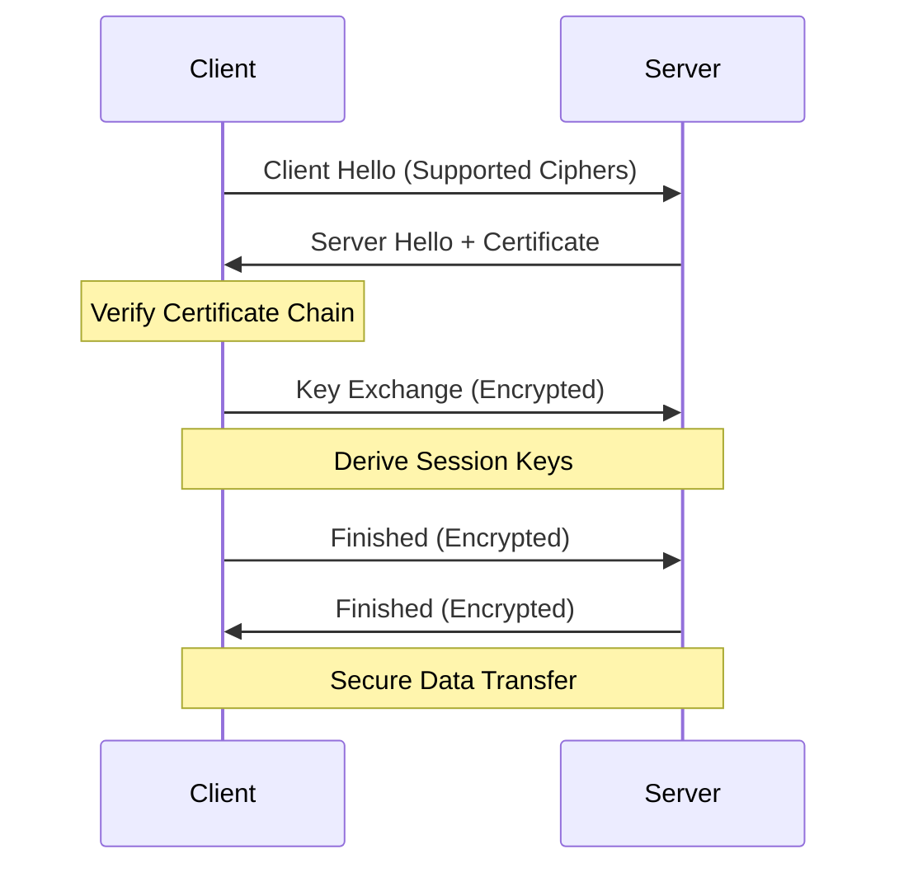

# TLS Basics

Your application is secure, the certificate is valid, but the browser shows a terrifying "Your connection is not private" warning. You check the server, and the certificate is there. **This is the TLS "Chain of Trust" at work.**

TLS (Transport Layer Security), formerly SSL, is the foundation of trust on the internet. For an SRE, it's a frequent source of "invisible" outages where the app is fine, but the encryption layer is broken.

## Quick Start: The Certificate Audit

If you encounter a TLS error, use these commands to see what the server is actually presenting:

1.  **Check the expiration**: Is the certificate still valid?
2.  **Verify the hostname**: Does the `CN` or `SAN` match the URL you are using?
3.  **Inspect the chain**: Are the intermediate certificates being sent?

```bash title="TLS Diagnostic Commands" linenums="1"
# Use openssl to see the certificate details
openssl s_client -connect api.example.com:443 -showcerts

# Get just the expiration date
echo | openssl s_client -connect api.example.com:443 2>/dev/null | openssl x509 -noout -dates

# Test with curl (shows handshake details)
curl -vI https://api.example.com
```

## The TLS Handshake

Before a single byte of application data is sent, the client and server must agree on how to encrypt it.



<div class="grid cards" markdown>

-   :material-certificate: **The Certificate**

    ---

    **Why it matters:** It's the server's identity card. It contains the Public Key and is signed by a Trusted Authority (CA).

    **Key insight:** A certificate is only as good as the CA that signed it.

-   :material-link-variant: **The Chain of Trust**

    ---

    **Why it matters:** Browsers don't know every website, but they know a few "Root CAs." Your server must provide the "Intermediate" links back to those roots.

    **Key insight:** "Missing Intermediate Certificate" is a top-3 cause of mobile app connection failures.

</div>

## Why TLS Matters for Platform Work

TLS isn't just for websites; it's a core security component for internal infrastructure:

*   **mTLS (Mutual TLS)**: Requiring *both* the client and server to present certificates. This is how Service Meshes like Istio secure pod-to-pod traffic.
*   **Compliance**: Standards like PCI-DSS and SOC2 require data to be encrypted in transit.
*   **Zero Trust**: TLS ensures that even if an attacker is on your internal network, they cannot read your traffic.

## Common Errors & Solutions

=== ":material-calendar-remove: Certificate Expired"

    **The Symptom:** `SSL_ERROR_EXPIRED_CERT_ALERT`.
    
    **SRE Check:**
    - When was the last renewal?
    - Is the automation (e.g., cert-manager) failing to talk to the CA?
    - Is the server still using an old certificate file despite a new one being generated? (Common with NGINX/Apache reload issues).

=== ":material-shield-search: Hostname Mismatch"

    **The Symptom:** `SSL_ERROR_BAD_CERT_DOMAIN`.
    
    **SRE Check:**
    - Does the certificate cover `example.com` but you are visiting `www.example.com`?
    - Check the Subject Alternative Name (SAN) field in the certificate.
    - Are you hitting the wrong load balancer or IP?

=== ":material-link-off: Incomplete Chain"

    **The Symptom:** Works in Chrome, but fails in `curl` or a Python script.
    
    **SRE Check:**
    - Some browsers "helpfully" download missing intermediates, but most libraries don't.
    - Use a tool like [SSLLabs](https://www.ssllabs.com/ssltest/) to check for chain issues.
    - Ensure your server is configured to send the "fullchain.pem" not just "cert.pem".

## Practice Problems

??? question "Practice Problem 1: Self-Signed Certificates"

    Why does `curl` fail when connecting to a server using a self-signed certificate, even if the encryption itself is mathematically sound?

    ??? tip "Answer"

        Because `curl` cannot verify the **Chain of Trust**. A self-signed certificate has no path back to a Root Certificate Authority that `curl` trusts. To fix this for testing, you use `-k` or `--insecure`, but in production, you must use a certificate signed by a trusted CA or add your own CA to the system's trust store.

??? question "Practice Problem 2: TLS Termination"

    Your load balancer handles TLS (Termination) and talks to your backend via plain HTTP. What is the main security risk of this "SSL Offloading" pattern?

    ??? tip "Answer"

        The traffic between the **load balancer and the backend** is unencrypted. If an attacker gains access to your internal network, they can sniff sensitive data (like passwords or PII) as it travels "in the clear" after the load balancer has decrypted it.

## Key Takeaways

| Term | What It Is |
|:-----|:-----------|
| **CA** | Certificate Authority - The organization that signs and validates certificates. |
| **SAN** | Subject Alternative Name - Allows a single certificate to cover multiple domains. |
| **Handshake** | The initial negotiation to establish a secure connection. |
| **Cipher Suite** | A set of algorithms used to secure the connection. |

## Further Reading

### Official Documentation
- [OpenSSL Documentation](https://www.openssl.org/docs/) - The definitive (if dense) reference.
- [Let's Encrypt Documentation](https://letsencrypt.org/docs/) - How modern automated TLS works.

### Related Tools
- **[cs.bradpenney.io - Public Key Cryptography](https://cs.bradpenney.io)** - The math behind the certificates.
- **[tls/efficiency/certificate_management.md](../../efficiency/tls/certificate_management.md)** - How to automate all of this so it never breaks again.

### Online Testing
- [Qualys SSL Labs](https://www.ssllabs.com/ssltest/) - The industry standard for testing public TLS configurations.
