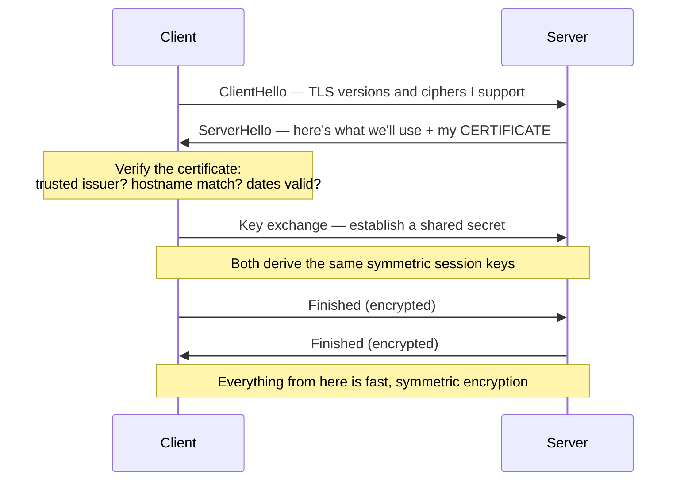
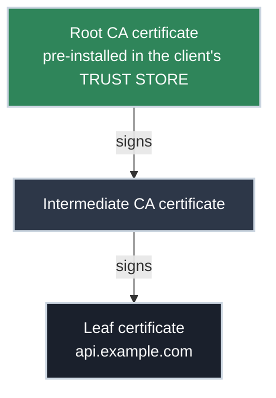

# TLS Basics: Certificates, Handshakes, and the Chain of Trust

!!! tip "Part of a Learning Path"
    This article is part of the [Put Your Kubernetes App on the Internet](https://bradpenney.io/pathways/cluster-to-internet) pathway on [bradpenney.io](https://bradpenney.io) — a guided sequence through the topic. It also stands on its own.

The site works in Chrome. The same URL in your deploy script throws `SSL: CERTIFICATE_VERIFY_FAILED`, and a teammate's `curl` agrees with the script. Same server, same certificate, same everything — except one client trusts it and the others don't. Nothing about that sentence makes sense until you know what actually happens in the first hundred milliseconds of an HTTPS connection.

That's this article: the TLS handshake, what a certificate really asserts, and the chain of trust that decides, independently on every client, whether to believe it. Once you can see those three pieces, every TLS error message turns from scary to specific: each one is a single, nameable verification step failing.

## The Handshake: Agreeing to Speak in Secret

TLS (Transport Layer Security, the protocol behind the `s` in `https`) has one job at connection time: let two machines that have never met agree on encryption keys, over a network where anyone might be listening. Everything below happens before the first byte of your actual request:



Three things in that diagram carry most of the weight:

- **The certificate is the server's opening claim:** "I am `api.example.com`, and here is my public key." The client doesn't take that on faith — the verification step in the middle is where trust is earned, and it's where every TLS failure you've ever seen lives.
- **The key exchange produces a shared secret an eavesdropper can't derive**, even though they watched every message. That this is possible at all is the magic of [public-key cryptography](https://cs.bradpenney.io/efficiency/security/public_key_cryptography/); the detour is worth it if you've never seen *why* it works.
- **The expensive asymmetric crypto is only the introduction.** Once session keys exist, the connection switches to symmetric encryption, which is fast enough that "TLS is slow" hasn't been true for years. Modern TLS 1.3 completes all of this in a single round trip.

This article covers the base handshake, where only the *server* proves its identity. Production systems increasingly run the mutual version (both sides presenting certificates), which is covered in depth in [HTTPS for APIs](https_for_apis.md).

## The Certificate: An Identity Card With Fields That Matter

The handshake's middle step, *verify the certificate*, is where the rest of this article lives: first the document being verified, then the chain that decides whether to believe it.

A certificate is a structured document binding a **name** to a **public key**, signed by someone whose job is to have checked the binding. Four fields do almost all the work:

| Field | What it says | Where it bites |
| :--- | :--- | :--- |
| **Subject / SAN** | The hostnames this cert is valid for | Hostname verification checks the **SAN** (Subject Alternative Name) list — the legacy Common Name field is ignored by modern clients |
| **Issuer** | The Certificate Authority (CA) that signed it | This is the link into the chain of trust below |
| **Validity** | Not-before and not-after dates | Expiry is the most common TLS outage; clients also reject certs from the "future" |
| **Public key** | The key the handshake will use | The server must hold the matching *private* key — the cert alone is public information |

Two SAN details worth knowing before you buy or issue anything:

- **Wildcards cover exactly one label.** `*.example.com` matches `api.example.com` but *not* `example.com` (no label) and *not* `api.v2.example.com` (two labels). Certs routinely carry multiple SAN entries precisely because of this.
- **The match is against the name the client asked for.** Reach the same server via a different hostname (an internal DNS alias, a raw IP) and the handshake fails with a hostname mismatch even though the server and cert are perfectly healthy.

## The Chain of Trust: Why Any of This Is Believable

Anyone can generate a certificate claiming to be `api.example.com`: the format proves nothing. What makes a certificate *mean* something is who signed it, and whether the client can follow signatures back to someone it already trusts.



- Every client ships a **trust store**: a bundle of a few hundred **root CA** certificates it trusts unconditionally. Your OS has one, browsers may carry their own, and language runtimes often bundle theirs.
- Roots don't sign server certificates directly; they're kept offline and sign **intermediates**, which do the day-to-day signing. So your certificate's trust path is leaf → intermediate → root.
- During the handshake, the client verifies each signature up the chain until it reaches a root **in its own trust store**. Reach one: trusted. Run out of links: rejected.

The operational catch: **the server is responsible for sending the intermediates.** The client only holds roots, so a server that sends just its leaf certificate leaves a gap in the chain. This is exactly the "works in Chrome, fails in `curl`" mystery from the opening — browsers cache intermediates from other sites and can even fetch missing ones, while `curl`, Python, and most libraries verify strictly with what they're given. Same certificate, different verifiers, different verdicts. The fix is always configuration: serve the **full chain** (the `fullchain.pem` that Let's Encrypt tooling generates, never just `cert.pem`).

!!! warning "Different clients, different trust stores"
    Trust isn't a property of the certificate — it's a property of *each client's trust store*. A minimal container image with no `ca-certificates` package trusts **nothing** and fails every TLS connection; an old base image may be missing newer roots. When one environment rejects a cert that others accept, compare trust stores before blaming the server.

### Self-Signed Certificates: Trust Without a Chain

A **self-signed** certificate is its own issuer: a chain of length one, anchored nowhere. The crypto is exactly as strong as a CA-signed cert; what's missing is any *reason for a stranger to believe it*. Clients reject it because there's no path into their trust store.

Treat self-signed certificates as a historical artifact, not an option. The old advice ("self-signed is fine internally") hasn't survived the modern threat landscape, where attackers, increasingly automated ones, win by chaining small weaknesses together: a fleet that tolerates unverifiable certificates is a fleet that can't tell an impostor from a service, and one that trains its scripts and people to skip verification. Internal infrastructure that needs TLS deserves a **private CA**: certificates signed by a root you control and distribute to trust stores, giving you real chains, short lifetimes, and [automated issuance](../../efficiency/tls/certificate_management.md). That's how internal mTLS works at scale, and the tooling has made it nearly free.

The reflexive `curl -k` / `verify=False` deserves the same verdict, harder: it doesn't "work around" the trust problem, it turns off the only check standing between you and connecting to an impostor. In scripts that ship to production, treat `-k` as a bug.

For your *public* app, you'll get a chain-anchored certificate for free: Let's Encrypt issues them after verifying you control the domain (those [TXT records](../dns/how_dns_works.md) again), and [the automation that renews them forever](../../efficiency/tls/certificate_management.md) means no human ever tracks the dates.

## Seeing the Chain Yourself

`openssl s_client` shows you the handshake from the client's chair, showing what was presented and whether verification passed:

```bash title="Inspect what the server presents" linenums="1"
echo | openssl s_client -connect api.example.com:443 -showcerts 2>/dev/null \
  | grep -E "s:|i:"                                     # (1)!
#  0 s:CN=api.example.com
#    i:C=US, O=Let's Encrypt, CN=R13
#  1 s:C=US, O=Let's Encrypt, CN=R13
#    i:C=US, O=Internet Security Research Group, CN=ISRG Root X1

echo | openssl s_client -connect api.example.com:443 2>/dev/null \
  | grep "Verify return code"                            # (2)!
# Verify return code: 0 (ok)
```

1. `-showcerts` prints every certificate the server sent; the `s:`/`i:` lines are each one's subject and issuer. Read the chain here: cert 0 (the leaf) is issued by the same name that cert 1 carries as its subject, link by link toward a root. If the list stops before a trust-store root, the server isn't sending its intermediates.
2. The verdict after `openssl` verifies the chain against the local trust store. `0 (ok)` means trusted; anything else names the failing step — `unable to get local issuer certificate` (broken/missing chain), `certificate has expired`, `self-signed certificate`.

For a public endpoint, [SSL Labs](https://www.ssllabs.com/ssltest/) runs this analysis exhaustively (chain completeness included), and [badssl.com](https://badssl.com/) hosts deliberately broken examples of everything in this article, so you can see each failure mode on demand.

## Why This Matters for Platform Work

- **TLS errors name their failing step, once you know the steps.** Expired, hostname mismatch, unknown issuer, incomplete chain: each maps to one check in the handshake's verification. Read the error as a pointer into the chain, not as generic breakage.
- **"Works here, fails there" is a *verifier* difference, not a server flake.** Different trust stores, different strictness about intermediates. Compare what each client trusts before restarting anything.
- **Certificates are public; private keys are the secret.** The handshake only proves identity because the server demonstrates possession of the private key matching the cert. Guard keys accordingly — a leaked cert is a shrug, a leaked key is an incident.

## Common Scenarios

=== ":material-link-off: Works in the browser, fails in `curl`"

    The server is sending only its leaf certificate. Browsers paper over the missing intermediate (cached or fetched on the fly); strict clients verify only what arrives and fail with `unable to get local issuer certificate`. Confirm with `openssl s_client -showcerts` (the chain stops short), and configure the server to serve the full chain.

=== ":material-shield-search: Hostname mismatch on a healthy cert"

    `SSL: no alternative certificate subject name matches` means the name the client used isn't in the SAN list — often a wildcard surprise (`*.example.com` doesn't cover the apex or a second level) or a client reaching the server by an alias or IP the cert never claimed. Fix the SAN list or the name the client uses; nothing is "broken."

=== ":material-clock-alert: Valid cert rejected on one machine only"

    One host reports `certificate is not yet valid` or `expired` while everyone else connects fine. Check that machine's **clock**: certificate validity is compared against local time, and a drifted VM, container, or embedded device rejects perfectly good certs. (Modern short-lived certificates make skew bite faster than it used to.)

## Practice Problems

??? question "Practice Problem 1: The Internal Service"

    Your app must call an internal service that presents a certificate issued by your company's private CA. The connection fails with `CERTIFICATE_VERIFY_FAILED`. A teammate suggests adding `verify=False` "since it's internal anyway." What's the right fix, and why is the suggestion worse than it sounds?

    ??? tip "Solution"

        The right fix is adding the **company CA's root certificate to the client's trust store** (or pointing the client at it, e.g. `REQUESTS_CA_BUNDLE` / `-CAfile`). That completes the chain: the service's cert verifies against your CA root exactly as a public cert verifies against a public root. `verify=False` doesn't scope to "our internal CA": it disables verification of **everyone**, so the client will happily complete a handshake with any machine that answers on that address. On an internal network, that's precisely the impostor scenario TLS exists to prevent — and the flag never gets removed once it ships.

??? question "Practice Problem 2: Reading the Chain"

    `openssl s_client -showcerts` against a failing endpoint prints exactly one certificate: `s:CN=api.example.com`, `i:C=US, O=Let's Encrypt, CN=R13`, and `Verify return code: 20 (unable to get local issuer certificate)`. Diagnose it precisely: what's missing, whose fault is it, and why do some clients still connect?

    ??? tip "Solution"

        The server sent only the **leaf**. Its issuer (`R13`) is a Let's Encrypt **intermediate**, not a root in anyone's trust store, and the server never supplied it, so strict clients can't link the leaf to a trusted root: verification dies at the missing link (code 20). It's a **server configuration** fault: it's serving `cert.pem` instead of `fullchain.pem`. Clients that still connect (mainly browsers) have that intermediate cached from other Let's Encrypt sites or fetch it on demand — which is why the outage looks intermittent and client-specific instead of total.

??? question "Practice Problem 3: One Wildcard, Three Hostnames"

    You have a certificate whose only SAN entry is `*.example.com`. Which of these handshakes succeed: (a) `https://api.example.com`, (b) `https://example.com`, (c) `https://api.v2.example.com`?

    ??? tip "Solution"

        Only **(a)**. A wildcard matches **exactly one label** at its position: `api.example.com` fits `*.example.com`. The apex `example.com` (b) has *no* label where the wildcard sits, and `api.v2.example.com` (c) has *two* — both fail hostname verification with a perfectly valid, unexpired certificate. Covering all three takes multiple SAN entries (e.g., `example.com`, `*.example.com`, `*.v2.example.com`), which is why SAN lists, not single names, are the norm.

## Key Takeaways

| Concept | What It Means |
| :--- | :--- |
| **Handshake** | Negotiate → present certificate → verify → exchange keys → switch to fast symmetric encryption |
| **Certificate** | A signed binding of hostnames (SAN) to a public key; public by design |
| **Private key** | The actual secret; possession of it is what the handshake proves |
| **Chain of trust** | Leaf → intermediate → root, verified against the *client's* trust store |
| **Full chain serving** | Servers must send intermediates; omitting them breaks strict clients only |
| **Wildcard SANs** | `*.example.com` covers one label: not the apex, not deeper subdomains |
| **`-k` / `verify=False`** | Disables the impostor check entirely; a bug in anything bound for production |

The handshake earns encryption; the chain of trust earns *belief*. Every TLS failure you'll meet is one of a half-dozen verification steps saying no — and now each one has a name, a command that reveals it, and a fix that isn't `-k`.

## Further Reading

### Related Networking Articles

- **[HTTPS for APIs: Where the Connection Gets Secured](https_for_apis.md)** — where TLS terminates in production, and mTLS: the mutual version of this handshake.
- **[How DNS Actually Works](../dns/how_dns_works.md)** — the TXT records certificate authorities use to verify you control a domain.
- **[Automating TLS Certificates: ACME and Let's Encrypt](../../efficiency/tls/certificate_management.md)** — automating issuance and renewal so none of this ever pages you.

### External Resources

- [Let's Encrypt: How It Works](https://letsencrypt.org/how-it-works/) — domain-validated certificates and the ACME protocol, plainly explained.
- [Qualys SSL Labs](https://www.ssllabs.com/ssltest/) — exhaustive analysis of any public endpoint's TLS, chain included.
- [badssl.com](https://badssl.com/) — live examples of every broken-TLS variant in this article, safe to poke at.
