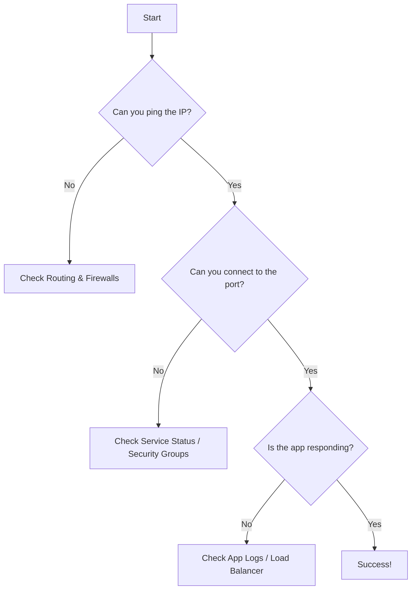

# Network Troubleshooting Basics

"I can't reach the database." It's one of the most common—and vague—tickets an SRE receives. Is the database down? Is the network congested? Is a firewall blocking the port? **To solve this, you need a systematic approach to connectivity testing.**

When connectivity fails, don't guess. Use tools that reveal the path and the state of the connection. This guide covers the "Big Three" of network troubleshooting: `ping`, `traceroute`, and `curl`.

## Quick Start: The Connection Checklist

If a service is unreachable, run these commands in order:

1.  **Check basic reachability**: `ping <ip>` (Is the host alive?)
2.  **Verify the path**: `mtr <ip>` (Where is the packet being dropped?)
3.  **Test the application port**: `curl -v <ip>:<port>` (Is the service listening?)

```bash title="Fast Diagnostic Commands" linenums="1"
# Ping with a limit of 4 packets
ping -c 4 8.8.8.8

# Trace the path to a host (using MTR for better data)
mtr --report --report-cycles 10 google.com

# Test a specific port with curl
curl -v telnet://10.0.0.5:5432
```

## The Troubleshooting Flowchart

Don't jump to conclusions. Follow the evidence from the physical layer up to the application.



<div class="grid cards" markdown>

-   :material-pulse: **ping**

    ---

    **Why it matters:** Uses ICMP to check if a remote host is up. It's the simplest "is it on?" test.

    ```bash title="Basic Ping" linenums="1"
    ping -c 5 google.com
    ```

    **Key insight:** High `latency` (rtt) or `packet loss` indicates network congestion or physical issues.

-   :material-map-marker-path: **traceroute / mtr**

    ---

    **Why it matters:** Shows every "hop" (router) between you and the destination. `mtr` (My Traceroute) combines ping and traceroute for real-time analysis.

    ```bash title="MTR Analysis" linenums="1"
    mtr 1.1.1.1
    ```

    **Key insight:** If loss starts at hop 3 and continues to the end, the problem is likely at hop 3.

</div>

## Why Troubleshooting Matters for Platform Work

In distributed systems, the network is the glue. Troubleshooting is critical because:

*   **Incident Response**: Fast diagnostics reduce MTTR (Mean Time To Recovery).
*   **Latency Analysis**: Identifying a slow hop can explain why an API call is sluggish.
*   **Security Validation**: Proving a port is blocked helps you refine Security Groups and NACLs.

## Common Symptoms & Solutions

=== ":material-timer-off: Connection Timeout"

    **The Symptom:** The command hangs and eventually says "Timeout."
    
    **SRE Check:**
    - Is a firewall or Security Group dropping packets silently?
    - Is the destination IP correct?
    - Is the routing table missing a path to the destination?

=== ":material-close-octagon: Connection Refused"

    **The Symptom:** You get an immediate "Connection refused" error.
    
    **SRE Check:**
    - The network is working! The host received your packet but rejected it.
    - Is the service actually running on that port?
    - Is the service listening on `0.0.0.0` or just `127.0.0.1`?

=== ":material-chart-bell-curve: Intermittent Latency"

    **The Symptom:** Some requests are fast, others are very slow.
    
    **SRE Check:**
    - Use `mtr` to look for packet loss or jitter at specific hops.
    - Check for "noisy neighbor" issues in cloud environments.
    - Is the network link saturated?

## Practice Problems

??? question "Practice Problem 1: Timeout vs Refused"

    You try to connect to a database and get "Connection refused." Your coworker says "The firewall must be blocking us." Why are they likely wrong?

    ??? tip "Answer"

        Firewalls typically **drop** packets silently, which results in a **timeout**. A "Connection refused" message means a TCP RST (reset) was sent back from the target host. This implies the network and firewall allowed the packet through, but the destination port has no service listening on it (or the service specifically rejected it).

??? question "Practice Problem 2: Using MTR"

    In an `mtr` report, you see 50% packet loss at hop 2, but 0% packet loss at hops 3 through 10. Is there a network problem?

    ??? tip "Answer"

        Probably not. If the loss doesn't **persist** through the subsequent hops, it usually means the router at hop 2 is rate-limiting ICMP traffic or prioritizing other traffic over your diagnostic packets. Only loss that continues to the final destination is usually a cause for concern.

## Key Takeaways

| Tool | Protocol | Primary Use |
|:-----|:---------|:------------|
| **ping** | ICMP | Basic reachability and latency |
| **traceroute** | UDP/ICMP | Path discovery |
| **mtr** | ICMP | Real-time path and loss analysis |
| **curl** | TCP/HTTP | Application-level connectivity |

## Further Reading

### Official Documentation
- [MTR GitHub](https://github.com/traviscross/mtr) - Source and documentation for My Traceroute.
- [Traceroute Man Page](https://linux.die.net/man/8/traceroute) - Understanding the flags.

### Related Tools
- **[cs.bradpenney.io - ICMP Protocol](https://cs.bradpenney.io)** - The theory behind how ping and traceroute work.
- **[tools.bradpenney.io - curl](https://tools.bradpenney.io)** - Mastering the Swiss Army knife of networking.

### Deep Dives
- [A Practical Guide to (Correctly) Troubleshooting with MTR](https://www.linode.com/docs/guides/diagnosing-network-issues-with-mtr/) - An excellent community guide.
