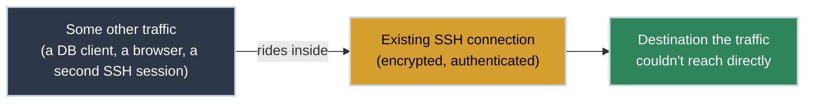

# SSH Tunnels: One Connection Carrying Another

A database you need is listening on `localhost` inside a private subnet. VPN access means a ticket and a day's wait. But you already have SSH access to a box that can reach it. **This is what a tunnel is for.**

The word "tunnel" gets used loosely — a VPN tunnel, an SSH tunnel, a `ProxyJump` tunnel — as if each is a different kind of connection. They're not. Once you see the one idea underneath, every variant is the same trick applied to a different problem.

## The One Idea

An SSH connection between your client and a server is already an encrypted, authenticated channel. A **tunnel** reuses that channel to carry traffic that didn't ask to be encrypted, or traffic that has no other way to reach its destination — instead of opening a second, separate connection for it.



Nothing about the *traffic itself* changes. A Postgres client still speaks the Postgres wire protocol; a second SSH session is still SSH. What changes is the path it travels — inside a channel you already have, instead of a new one you'd otherwise need.

## Four Names for the Same Trick

SSH exposes that one idea through four flags, each solving a different shape of "I can't reach this directly":

<div class="grid cards" markdown>

-   :material-arrow-left: **Local Forwarding (`-L`)**

    ---

    **Why it matters:** A remote service, made to answer on your own machine as if it were local.

    ```bash title="Reach a Remote-Only Database Locally" linenums="1"
    ssh -L 5432:localhost:5432 db-host
    ```

    Point a local client at `localhost:5432`; SSH carries the traffic to `db-host` and back.

-   :material-arrow-right: **Remote Forwarding (`-R`)**

    ---

    **Why it matters:** The reverse — a service running on *your* machine, exposed through the remote server.

    ```bash title="Expose a Local Dev Server Remotely" linenums="1"
    ssh -R 8080:localhost:3000 remote-host
    ```

    Anyone who can reach `remote-host:8080` reaches your local port 3000.

-   :material-router-network: **Dynamic Forwarding (`-D`)**

    ---

    **Why it matters:** Turns the tunnel into a full SOCKS proxy instead of one fixed port — everything you route through it goes out from the remote side.

    ```bash title="Open a SOCKS Proxy Through a Host" linenums="1"
    ssh -D 1080 remote-host
    ```

    Point a browser or `curl --socks5` at `localhost:1080`.

-   :material-transit-connection-variant: **ProxyJump (`-J`)**

    ---

    **Why it matters:** The traffic riding inside the tunnel is a *second SSH connection*, relayed through the first to reach a host that isn't directly reachable.

    ```bash title="Chain Through an Intermediary Host" linenums="1"
    ssh -J user@jump-host user@10.0.4.122
    ```

    See [SSH Mastery](https://tools.bradpenney.io/efficiency/ssh_mastery/) on the Dev Tools site for the config-file version (`ProxyJump`) and jump-host setup in full.

</div>

The first three carry *other protocols* through SSH. `ProxyJump` carries *more SSH* through SSH — same mechanism, one layer recursive.

## Common Scenarios

=== ":material-database: A Database With No Public Access"

    The database only accepts connections from inside its own subnet, and opening it up isn't happening. If you can SSH into any host inside that subnet, local forwarding gets you a connection without touching the firewall:

    ```bash title="Tunnel to an Internal Database" linenums="1"
    ssh -L 5432:db-internal:5432 bastion
    psql -h localhost -p 5432
    ```

    The client believes it's talking to `localhost`. Every byte is actually crossing the SSH connection to `bastion` first.

=== ":material-laptop: Showing Someone a Local Build"

    A teammate needs to see something running on your laptop, and it isn't deployed anywhere yet. Remote forwarding puts a port of theirs in front of it:

    ```bash title="Expose Your Local Server Through a Shared Host" linenums="1"
    ssh -R 9000:localhost:3000 shared-host
    ```

    Anyone with access to `shared-host:9000` is now looking at your `localhost:3000`, without you deploying anything.

=== ":material-incognito: Routing Traffic From a Specific Location"

    You need outbound traffic to originate from a specific network — testing what a service looks like from a particular region, say. Dynamic forwarding turns one SSH connection into a proxy for anything that supports SOCKS:

    ```bash title="Route curl Through a Remote Vantage Point" linenums="1"
    ssh -D 1080 -N remote-host &
    curl --socks5 localhost:1080 https://example.com/
    ```

    `-N` tells SSH not to open a shell — you only wanted the tunnel.

## Why This Matters for Platform Work

- **A tunnel is a firewall-safe way to reach something you already have SSH access to.** Requesting a VPN or a firewall exception is a ticket and a wait. If you can already SSH to a host inside the boundary you need, `-L` gets you a working connection in the time it takes to type the command — no change request, no review.
- **`-J` chains without leaving key material lying around.** A jump host that never sees your traffic in the clear, and never needs your private key copied onto it, is the difference between "we hop through a bastion" and "we hop through a bastion safely." The connection to the final target is still end-to-end from your machine.
- **Dynamic forwarding is a debugging tool, not just an escape hatch.** Routing a single `curl` through `-D` to see what a service looks like from another network's vantage point is often faster than standing up test infrastructure in that location.
- **Every one of these is a normal SSH connection underneath.** Nothing here needs special server-side software, a VPN client, or admin rights beyond SSH access itself — which is exactly why it works in locked-down environments where nothing else does.

## Practice Problems

??? question "Practice Problem 1: Picking the Right Flag"

    You need to connect a local GUI database client to a Postgres instance that only listens on `localhost` on a remote server. Which forwarding flag, and why?

    ??? tip "Answer"

        `-L` (local forwarding). The service exists on the *remote* side and you want it to answer locally — that's exactly what `-L` does: `ssh -L 5432:localhost:5432 remote-host` makes `localhost:5432` on your machine reach Postgres on the remote box.

??? question "Practice Problem 2: What ProxyJump Actually Carries"

    `ssh -J bastion target` and `ssh -L 5432:db:5432 bastion` both use the word "tunnel." What's the difference in what's actually flowing through each one?

    ??? tip "Answer"

        In the `-L` case, the tunnel carries Postgres wire-protocol traffic — a foreign protocol wrapped inside SSH. In the `-J` case, the tunnel carries a *second, independent SSH connection* to `target` — SSH inside SSH. Same mechanism (an existing encrypted channel carrying something else), different cargo.

## Key Takeaways

| Flag | Direction | Carries |
|:-----|:----------|:--------|
| `-L` | Remote service → local port | Any protocol (DB, internal API, etc.) |
| `-R` | Local service → remote port | Any protocol |
| `-D` | Dynamic, via SOCKS | Anything a SOCKS-aware client sends |
| `-J` | Chains to a further host | A second SSH connection |

## What's Next

For the config-file side of this — turning `ProxyJump` into a named, reusable host entry instead of a flag you retype — see [SSH Mastery](https://tools.bradpenney.io/efficiency/ssh_mastery/) on the Dev Tools site.

## Further Reading

### Official Documentation
- [`ssh_config` manual](https://man.openbsd.org/ssh_config) - `LocalForward`, `RemoteForward`, `DynamicForward`, and `ProxyJump` directives in full.
- [OpenSSH manual](https://man.openbsd.org/ssh) - `-L`, `-R`, `-D`, `-J` flag reference.

### Related Tools & Concepts
- [SOCKS protocol overview (Wikipedia)](https://en.wikipedia.org/wiki/SOCKS) - What a SOCKS proxy actually does with the traffic you send it.

### Deep Dives
- [SSH Mastery](https://tools.bradpenney.io/efficiency/ssh_mastery/) - `~/.ssh/config` aliases, jump hosts, and key-based auth in practice.

Four flags, one idea: an SSH connection is a channel, and a channel can carry more than the shell session it was opened for. Once that clicks, `-L`, `-R`, `-D`, and `-J` stop being four things to memorize and become one trick, aimed at whichever direction the problem happens to be pointing.
