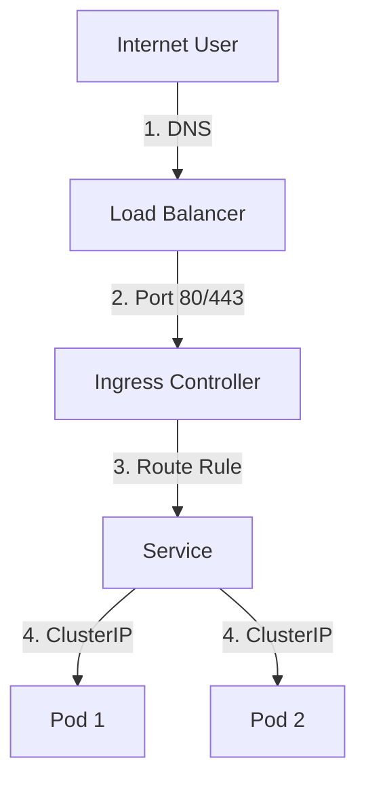

# Services and Ingress

You've deployed your pods, they're running, and the logs look great. But when you try to reach them from outside the cluster, you get a "Connection Timed Out" or a 404. **This is where Kubernetes networking abstraction meets the real world.**

In Kubernetes, pods are ephemeral—they die and are reborn with new IP addresses. To build a reliable system, you need stable entry points. This guide explains how **Services** provide internal stability and **Ingress** provides external access.

## Quick Start: Connectivity Check

If a service is unreachable, use these commands to verify the networking chain:

1.  **Check Service Endpoints**: Does the Service actually "see" your pods?
2.  **Test Internal DNS**: Can pods resolve the service name?
3.  **Inspect Ingress Controller**: Is the traffic even reaching the cluster?

```bash title="K8s Networking Diagnostics" linenums="1"
# Verify which Pods are backend for a Service
kubectl get endpoints my-service

# Run a temporary pod to test internal DNS resolution
kubectl run dns-test --rm -it --image=busybox -- nslookup my-service

# Check Ingress resource configuration
kubectl describe ingress my-ingress
```

## The Path of a Packet

Traffic follows a layered path from the user's browser down to your application container.



<div class="grid cards" markdown>

-   :material-Directions: **Services**

    ---

    **Why it matters:** Provides a stable IP address (`ClusterIP`) and DNS name for a set of pods. It handles internal load balancing using `kube-proxy`.

    **Key insight:** If `kubectl get endpoints` is empty, your Service's `selector` doesn't match your Pod's `labels`.

-   :material-gate: **Ingress**

    ---

    **Why it matters:** Manages external access to services, typically via HTTP/HTTPS. It provides URL-based routing and TLS termination.

    **Key insight:** An Ingress *resource* is just a config; you need an Ingress *Controller* (like NGINX or AWS ALB) to actually process traffic.

</div>

## Why K8s Networking Matters for Platform Work

Understanding this stack is essential for:

*   **Zero-Downtime Deploys**: Services automatically stop sending traffic to pods that are terminating or failing readiness probes.
*   **Cost Optimization**: Consolidating multiple services behind a single Ingress/Load Balancer saves cloud infrastructure costs.
*   **Security**: Ingress controllers often provide a central place for WAF (Web Application Firewall) and rate limiting.

## Common Scenarios & Solutions

=== ":material-magnify: Empty Endpoints"

    **The Problem:** You can't reach the service, and `kubectl get endpoints` shows `<none>`.
    
    **SRE Check:**
    - Compare the `spec.selector` in your Service YAML with the `metadata.labels` in your Deployment. They must be an EXACT match.
    - Are the pods actually running?

=== ":material-router-network: 503 Service Temporarily Unavailable"

    **The Problem:** The Ingress controller is reachable, but it can't find a backend to serve the request.
    
    **SRE Check:**
    - Are your Pods passing their **Readiness Probes**? A pod that is "Running" but not "Ready" will be removed from the Service endpoints.
    - Check the Ingress Controller logs (`kubectl logs -n ingress-nginx ...`).

=== ":material-dns: Internal DNS Failure"

    **The Problem:** Pod A can't reach Pod B via `service-b.namespace.svc.cluster.local`.
    
    **SRE Check:**
    - Check the health of the `coredns` pods in the `kube-system` namespace.
    - Does the pod's `/etc/resolv.conf` have the correct `search` domains?

## Practice Problems

??? question "Practice Problem 1: Service Types"

    What is the difference between a `ClusterIP` and a `LoadBalancer` service type?

    ??? tip "Answer"

        - **ClusterIP**: The default. It provides an IP address reachable only **inside** the cluster.
        - **LoadBalancer**: It does everything ClusterIP does, but *also* asks the cloud provider (AWS/GCP/Azure) to provision a physical load balancer that routes external traffic into the cluster.

??? question "Practice Problem 2: Readiness vs Liveness"

    If a Pod fails its **Liveness Probe**, Kubernetes restarts it. If it fails its **Readiness Probe**, what happens to the networking?

    ??? tip "Answer"

        The Pod is removed from the **Endpoints** list of any associated Services. It remains running, but the Service will stop sending it traffic until the Readiness Probe passes again. This prevents users from hitting a pod that is still "warming up" or is temporarily overwhelmed.

## Key Takeaways

| Component | Scope | Primary Function |
|:----------|:------|:-----------------|
| **Pod IP** | Internal | Direct address (volatile) |
| **ClusterIP** | Internal | Stable internal load balancing |
| **NodePort** | External | Exposes service on a static port on every Node |
| **Ingress** | External | Layer 7 routing (HTTP paths/hostnames) |

## Further Reading

### Official Documentation
- [Kubernetes Service Concept](https://kubernetes.io/docs/concepts/services-networking/service/) - Official guide to services.
- [Kubernetes Ingress Concept](https://kubernetes.io/docs/concepts/services-networking/ingress/) - Official guide to ingress.

### Related Tools
- **[k8s.bradpenney.io - Services](https://k8s.bradpenney.io)** - Deep dive into Service manifests and types.
- **[load_balancers/essentials/load_balancer_basics.md](../../load_balancers/essentials/load_balancer_basics.md)** - Understand how external LBs interact with Ingress.

### Deep Dives
- [A Guide to the Kubernetes Networking Model](https://sookocheff.com/post/kubernetes/understanding-kubernetes-networking-model/) - Excellent conceptual overview.
