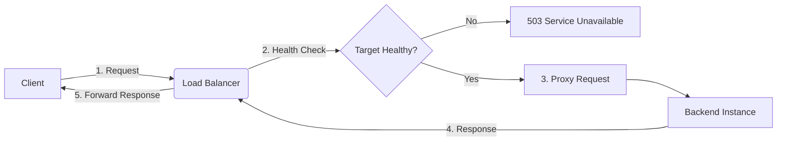

# Load Balancer Basics

The load balancer shows all targets are "Healthy," but users are reporting 502 Bad Gateway errors. You check the application—it's running. You check the network—it's clear. **This is the classic load balancer mystery.**

Load balancers are the gatekeepers of your infrastructure. When they work, they provide scale and resilience. When they fail, or are misconfigured, they can become a single point of failure that masks the real problem.

## Quick Start: The Health Check Audit

If you suspect a load balancer issue, check these three things immediately:

1.  **Check the status code**: 502 (Bad Gateway), 503 (Service Unavailable), and 504 (Gateway Timeout) all mean different things.
2.  **Verify health check logs**: Are the targets flapping? What is the *actual* response code from the health check?
3.  **Test the target directly**: Bypass the load balancer and `curl` the backend instance.

```bash title="Direct Target Testing" linenums="1"
# Test the backend directly (bypass the LB)
curl -v http://10.0.1.50:8080/health

# Check the Load Balancer response headers
curl -I https://api.example.com
```

## How Traffic Flows Through a Load Balancer

Understanding the handoff between the client, the load balancer, and the backend is key to debugging.



<div class="grid cards" markdown>

-   :material-traffic-light: **Health Checks**

    ---

    **Why it matters:** This is how the LB decides where to send traffic. If this is wrong, healthy traffic goes to dead instances (or nowhere at all).

    **Key insight:** A health check should test more than "is the port open"—it should verify the app can talk to its database.

-   :material-account-switch: **Algorithms**

    ---

    **Why it matters:** Decides *which* healthy instance gets the next request. Common choices are Round Robin, Least Connections, or IP Hash.

    **Key insight:** Use "Least Connections" for long-lived requests (like file uploads) to prevent overloading a single server.

</div>

## Why Load Balancers Matter for Platform Work

Load balancers do more than just distribute traffic; they provide essential platform features:

*   **SSL/TLS Termination**: Offloading the compute-heavy encryption/decryption from the application servers.
*   **High Availability**: Automatically removing failing instances from the rotation.
*   **Blue/Green Deployments**: Shifting traffic between different versions of your application with zero downtime.

## Common Errors & Solutions

=== ":material-alert-decagram: 502 Bad Gateway"

    **The Meaning:** The load balancer (the gateway) received an invalid response from the backend.
    
    **SRE Check:**
    - Is the application crashing or restarting?
    - Is the application listening on the wrong port?
    - Is there a protocol mismatch (e.g., LB speaks HTTP/2, backend only speaks HTTP/1.1)?

=== ":material-timer-alert: 504 Gateway Timeout"

    **The Meaning:** The backend took too long to respond, and the load balancer gave up.
    
    **SRE Check:**
    - Is the backend processing a slow query?
    - Is the load balancer's timeout shorter than the application's processing time?
    - Is the backend instance CPU-saturated?

=== ":material-account-cancel: 503 Service Unavailable"

    **The Meaning:** The load balancer has no healthy targets to send the request to.
    
    **SRE Check:**
    - Are ALL instances failing health checks?
    - Is the load balancer itself being rate-limited or overwhelmed?
    - Did a deployment just scale your service to zero?

## Practice Problems

??? question "Practice Problem 1: The Misleading Health Check"

    Your application is returning 500 errors to users, but the load balancer says the targets are "Healthy." Why is this happening?

    ??? tip "Answer"

        The health check is likely too simple. It might be checking a static file or just verifying that the TCP port is open. If the health check expects a `200 OK` but doesn't care about the application logic, the LB will keep sending traffic to a "healthy" instance that is actually failing to process real requests.

??? question "Practice Problem 2: Sticky Sessions"

    You notice that one backend server is handling 90% of the traffic, even though you have 5 servers. What load balancer feature might be causing this?

    ??? tip "Answer"

        **Sticky Sessions** (or Session Affinity). This feature forces a client to stay with the same backend server for the duration of their session. If a few "power users" with long sessions are all pinned to the same server, it can lead to massive traffic imbalance.

## Key Takeaways

| Error Code | Responsibility | Common Root Cause |
|:-----------|:---------------|:------------------|
| **502** | Backend | Application crash or port mismatch |
| **504** | Backend/Network | Slow queries or timeout settings |
| **503** | Load Balancer | No healthy targets available |
| **4xx** | Client | Bad request or auth failure |

## Further Reading

### Official Documentation
- [AWS Elastic Load Balancing](https://docs.aws.amazon.com/elb/) - Deep dive into Cloud LBs.
- [HAProxy Documentation](https://www.haproxy.org/#docs) - The industry standard for software load balancing.
- [NGINX Load Balancing](https://docs.nginx.com/nginx/admin-guide/load-balancer/http-load-balancer/) - Popular choice for ingress.

### Related Tools
- **[Exploring Computer Science](https://cs.bradpenney.io)** - Understand the difference between network (Layer 4) and application (Layer 7) load balancing.
- **[Network Troubleshooting Basics](../../troubleshooting/essentials/network_troubleshooting_basics.md)** - Use these tools to test your backends directly.
