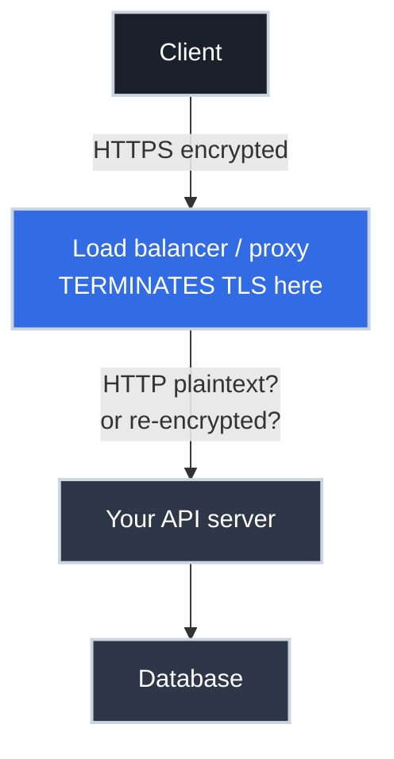

# HTTPS for APIs: Where the Connection Gets Secured

You put `https://` in front of your API and call it secured. And mostly, it is — but "secured" hides a question that matters enormously the moment you're designing the system: **where, physically, does the encryption stop?** Because it almost never stops where people assume, and that gap is the difference between an API that's actually private and one that quietly ships sensitive data in the clear inside your own network.

This article is about that question. It assumes you've seen [how an endpoint gets exposed](../../http/essentials/from_url_to_endpoint.md) — here we add the lock to the door. We won't re-explain the TLS handshake itself; we'll focus on what HTTPS means *for an API* and where it terminates.

## What HTTPS Actually Protects (and What It Doesn't)

HTTPS is HTTP carried inside a TLS-encrypted connection. It gives you three guarantees **while data is in transit**:

- **Confidentiality** — eavesdroppers on the network can't read the request or response.
- **Integrity** — the data can't be tampered with en route without detection.
- **Authenticity** — the certificate proves you're talking to the real server, not an impostor (the chain of trust).

What HTTPS does **not** do is just as important to internalize:

- It does **not** authenticate the *caller*. HTTPS proves the server's identity to the client, not the other way around. Knowing *who is calling* is [authentication](https://cs.bradpenney.io/efficiency/web/authentication_vs_authorization/), a separate layer that rides *inside* the encrypted channel.
- It does **not** protect data **at rest** or **after** the connection terminates. The instant TLS is decrypted, the data is plaintext again — and that instant is the whole story of this article.

!!! warning "HTTPS secures the pipe, not the payload's whole life"

    A common and dangerous assumption is "we use HTTPS, so the data is encrypted end to end." HTTPS encrypts data *between two endpoints of a connection*. If there are multiple hops (and in production there always are), each hop is its own connection that may or may not be encrypted. The lock on the address bar says nothing about what happens after the first hop.

## TLS Termination: The Concept That Changes Everything

**TLS termination** is the point where the encrypted connection is decrypted back into plain HTTP. Whatever component does the decryption is said to "terminate TLS." In a real system, that's rarely your application — and that's by design.

Consider the most common production setup. The client opens an HTTPS connection, but it doesn't reach your app directly. It reaches a [reverse proxy or load balancer](../../api_gateways/efficiency/reverse_proxies_and_gateways.md) at the edge, which **terminates TLS** and forwards the now-decrypted request onward.



Why terminate at the edge instead of in the app?

- **Certificate management in one place.** The proxy holds and renews the certificate; your dozen backend services don't each need one. (Renewal automation is its own discipline.)
- **Performance.** The encryption/decryption work is handled by infrastructure built for it, freeing your app.
- **Routing and inspection.** The proxy can read the (now plaintext) request to route, rate-limit, and log it — it can't do that while it's encrypted.

The catch: **after termination, that forwarded request is plaintext unless you do something about it.** Which leads to the decision you have to make.

## The Three Models You're Actually Choosing Between

When you "secure an API with HTTPS," you're implicitly picking one of these. Know which one you've got.

=== ":material-lan-disconnect: TLS Termination at the Edge"

    TLS is decrypted at the proxy; traffic from proxy to backend is **plain HTTP** over the internal network.

    - **Pros:** simplest, fastest, one certificate.
    - **Cons:** the internal hop is unencrypted. Fine *only if* that network is genuinely trusted and isolated. Anyone who can sniff the internal network sees plaintext — including any auth tokens inside it.
    - **Use when:** the backend network is private and trusted (and you've accepted that assumption deliberately).

=== ":material-lan-connect: TLS Re-encryption (Passthrough to Backend)"

    The proxy terminates the client's TLS, then opens a **new** TLS connection to the backend. Encrypted on both legs.

    - **Pros:** no plaintext on the wire, even internally; the proxy can still inspect/route.
    - **Cons:** more certificates and CPU; slightly more complex.
    - **Use when:** the internal network isn't fully trusted, or compliance requires encryption in transit everywhere.

=== ":material-shield-lock: Mutual TLS (mTLS)"

    Both sides present certificates, so the **server authenticates the client** too — not just the reverse.

    - **Pros:** strong service-to-service identity; the connection itself proves who's calling.
    - **Cons:** every client needs a managed certificate; operationally heavier.
    - **Use when:** service-to-service traffic in a zero-trust architecture or service mesh.

The progression — terminate, re-encrypt, mutually authenticate — is a ladder of trust. Most public APIs terminate at the edge; security-sensitive internal systems re-encrypt or use mTLS. The wrong default ("HTTPS at the edge, plaintext everywhere behind it, on a network that isn't actually isolated") is one of the most common real-world exposures.

## Quick Start: See Where TLS Terminates

You can inspect the encrypted side from any client. The trickier question — *what happens after termination* — you confirm from inside the network.

```bash title="Inspect the client-facing TLS" linenums="1"
# What certificate is presented, and by whom?
echo | openssl s_client -connect api.example.com:443 2>/dev/null \
  | openssl x509 -noout -subject -issuer -dates   # (1)!

# Watch curl negotiate TLS, then send the request
curl -v https://api.example.com/health            # (2)!

# Confirm HTTP is redirected to HTTPS (it should be)
curl -sI http://api.example.com/ | grep -i location   # (3)!
```

1. Shows the subject (who the cert is for), issuer (the CA), and validity dates — often revealing it's the *load balancer's* cert, not the app's, which is your first clue that the edge terminates TLS.
2. The verbose handshake shows the negotiated TLS version and cipher before any HTTP is sent.
3. A well-configured API redirects plain `http://` to `https://` so nothing is ever sent unencrypted by mistake.

## Why This Matters for Platform Work

- **"We use HTTPS" is an incomplete answer to "is the API secure in transit?"** The real answer depends on where TLS terminates and what happens on the hops *after* it. If a token travels plaintext from the load balancer to the app across a shared network, an attacker on that network has it.
- **Certificates usually live at the termination point.** When TLS breaks ("certificate expired," "hostname mismatch"), the fix is almost always at the proxy/load balancer that terminates it, not in your application — knowing this saves you debugging the wrong layer.
- **The termination model is a deliberate trade-off, not a default to ignore.** Choosing edge-termination commits you to trusting the internal network. That's a fine choice *if made on purpose* — and a breach waiting to happen if assumed.

## Common Scenarios

=== ":material-alert: 'Certificate expired' but the app is fine"

    The app server is healthy, but clients get TLS errors. The certificate lives at the **termination point** (load balancer / proxy / CDN), and *that's* what expired. Renewing it on the app server does nothing. Identify what terminates TLS (the `openssl s_client` issuer/subject is a hint), and fix the cert there. Automate renewal so it never recurs.

=== ":material-eye: A token leaked on the internal network"

    Traffic was sniffed *inside* the VPC and bearer tokens were visible. The edge terminated TLS and forwarded **plaintext** over a network that wasn't as isolated as assumed. The remedy is to **re-encrypt** the backend hop (or adopt mTLS) so there's no plaintext leg, and to treat "internal" networks as untrusted by default.

=== ":material-swap-vertical: Redirect loop after adding a proxy"

    After putting a TLS-terminating proxy in front, the app keeps redirecting `http`→`https` in a loop. The proxy speaks plain HTTP to the app, so the app thinks the request is insecure and redirects — forever. The fix is the `X-Forwarded-Proto` header: the proxy tells the app "the *original* request was HTTPS," so the app stops redirecting. This header existing at all is a direct consequence of termination happening upstream.

## Practice Problems

??? question "Practice Problem 1: Where's the Certificate?"

    Clients of `https://api.example.com` suddenly get "certificate has expired," but your application servers were redeployed last week with fresh configs and the app logs look healthy. Where do you look?

    ??? tip "Solution"

        At whatever **terminates TLS** — almost certainly a load balancer, reverse proxy, or CDN in front of your app, not the app itself. In a typical setup the client's TLS connection never reaches your application; the edge presents the certificate. Redeploying the app can't fix a cert it doesn't serve. Run `echo | openssl s_client -connect api.example.com:443 | openssl x509 -noout -issuer -subject` to see whose certificate is presented, then renew it at the termination point (and automate renewal).

??? question "Practice Problem 2: Is the Token Safe?"

    Your architecture is: client → (HTTPS) → load balancer → (HTTP) → API → (HTTP) → database, all inside a cloud VPC. A reviewer flags that bearer tokens might be exposed. Are they right, and what changes?

    ??? tip "Solution"

        They're right to flag it. TLS **terminates at the load balancer**, so from there inward the token travels as **plaintext** over the internal network. Anyone able to capture traffic in the VPC (a compromised host, a misconfigured mirror, a malicious insider) can read it. Whether that's acceptable depends on how truly isolated and trusted the VPC is — but "internal" is not the same as "encrypted." To close it, **re-encrypt** the internal hops (TLS from LB to API) or adopt **mTLS** for service-to-service calls, eliminating the plaintext leg.

??? question "Practice Problem 3: HTTPS Is Not Authentication"

    A teammate argues, "Our API is over HTTPS, so we know requests come from trusted clients." Why is this wrong?

    ??? tip "Solution"

        HTTPS authenticates the **server to the client** (via the certificate) and encrypts the channel — it says nothing about *who the client is*. Any client on the internet can open a valid HTTPS connection to your public API. Knowing the caller's identity requires [authentication](https://cs.bradpenney.io/efficiency/web/authentication_vs_authorization/) *inside* the encrypted channel (an API key, token, or — at the TLS layer — mTLS, which is the exception that *does* authenticate the client). HTTPS protects the conversation; it doesn't vouch for who started it.

## Key Takeaways

| Concept | What It Means |
| :--- | :--- |
| **HTTPS = HTTP over TLS** | Confidentiality, integrity, server authenticity — *in transit only* |
| **Not caller auth** | HTTPS proves the *server*; identifying the *client* is a separate layer |
| **TLS termination** | The point where encryption is decrypted — usually the edge, not your app |
| **Edge termination** | Fast and simple, but internal hop is plaintext unless you act |
| **Re-encryption / mTLS** | Encrypt internal hops too; mTLS also authenticates the client |
| **Certs live at termination** | TLS errors are fixed at the proxy/LB, not the application |

## Further Reading

### Related Networking Articles

- **TLS Basics** *(draft — coming soon)* — the handshake and the chain of trust this builds on.
- **Certificate Management** *(draft — coming soon)* — automating renewal so termination points never expire.
- **[From URL to Endpoint](../../http/essentials/from_url_to_endpoint.md)** — how the connection reaches the server in the first place.
- **[Reverse Proxies and API Gateways](../../api_gateways/efficiency/reverse_proxies_and_gateways.md)** — the component that usually terminates TLS.

### Computer Science Fundamentals

- **[Authentication vs Authorization (cs.bradpenney.io)](https://cs.bradpenney.io/efficiency/web/authentication_vs_authorization/)** — the caller-identity layer HTTPS doesn't provide.

### External Resources

- [Cloudflare: What is HTTPS?](https://www.cloudflare.com/learning/ssl/what-is-https/) — a clear conceptual overview.
- [Cloudflare: What is SSL/TLS termination?](https://www.cloudflare.com/learning/ssl/what-is-ssl-termination/) — termination in depth.
- [MDN: HTTP Strict-Transport-Security](https://developer.mozilla.org/en-US/docs/Web/HTTP/Headers/Strict-Transport-Security) — forcing HTTPS for every request.

---

"Put it behind HTTPS" is the start of securing an API in transit, not the end. The question that actually matters is *where the lock comes off* — and in production that's almost always at the edge, leaving an internal hop you have to think about on purpose. Know your termination point, decide what happens after it, and "is this secure in transit?" becomes a question you can answer precisely instead of hopefully.
