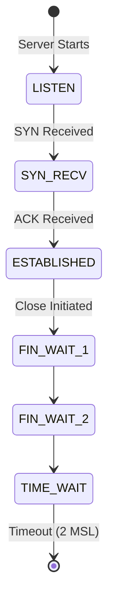

# Advanced Debugging

The network is fine, the firewall is open, and the process is running—but the connection is still being refused. You suspect the application isn't actually listening where it says it is, or perhaps the kernel's socket buffers are full. **This is when you stop looking at the network and start looking at the host.**

Advanced debugging is about inspecting the bridge between the operating system and the network. This guide covers `ss` (socket statistics), `netstat`, and `lsof` to help you see exactly what's happening inside your Linux servers.

## Quick Start: The Host-Level Audit

When a process isn't behaving, run these commands to see its network footprint:

1.  **Check listening sockets**: Is the app listening on the right IP and port?
2.  **Verify connection states**: Are there thousands of connections stuck in `TIME_WAIT`?
3.  **Find the process**: Which PID is actually holding that port open?

```bash title="Advanced Socket Inspection" linenums="1"
# See all listening TCP ports and the process name
ss -tlp

# Show all established connections and their timers
ss -tap

# Find which process is using port 8080
lsof -i :8080
```

## The Socket Lifecycle

Every TCP connection moves through a series of states. Understanding these is critical for performance debugging.



<div class="grid cards" markdown>

-   :material-format-list-bulleted-type: **ss (Socket Statistics)**

    ---

    **Why it matters:** The modern replacement for `netstat`. It's faster and provides more detail about TCP internals (like RTT and congestion windows).

    **Key insight:** Use `ss -s` for a quick summary of all socket types on the system.

-   :material-identifier: **lsof (LiSt Open Files)**

    ---

    **Why it matters:** In Linux, everything is a file—including sockets. `lsof` shows you the direct link between a file descriptor and a network connection.

    **Key insight:** Great for finding "ghost" processes that are holding a port open after a failed restart.

</div>

## Why Advanced Debugging Matters for Platform Work

At scale, generic "network" issues often turn out to be kernel or application-level resource constraints:

*   **Port Exhaustion**: If your server creates too many outbound connections too fast, it will run out of available source ports (ephemeral ports).
*   **Zombie Listeners**: A process might crash but keep its sockets in a `LISTEN` state, preventing the new process from starting.
*   **Buffer Bloat**: Using `ss -i` can reveal if a specific connection is suffering from high RTT or packet retransmissions, pointing to a performance bottleneck.

## Common Scenarios & Solutions

=== ":material-ghost: Port Already in Use"

    **The Problem:** Your app fails to start with `Address already in use`.
    
    **SRE Check:**
    - Use `ss -tlp | grep <port>` to find the PID of the process using it.
    - Check if a dead process left a socket in `TIME_WAIT`. You may need to enable `tcp_tw_reuse` in the kernel (with caution).

=== ":material-clock-fast: TIME_WAIT Accumulation"

    **The Problem:** Your server is sluggish, and `ss -s` shows 50,000+ sockets in `TIME_WAIT`.
    
    **SRE Check:**
    - This usually means your app is opening/closing connections too fast (not using connection pooling).
    - Check if you're hitting the `net.ipv4.ip_local_port_range` limit.

=== ":material-eye-off: Listening on 127.0.0.1"

    **The Problem:** You can `curl` the app from inside the server, but not from the outside.
    
    **SRE Check:**
    - Use `ss -tlp`. If the local address is `127.0.0.1:<port>`, the app is only listening on the loopback interface.
    - Solution: Change the app config to listen on `0.0.0.0` (all interfaces) or the specific private IP of the server.

## Practice Problems

??? question "Practice Problem 1: ss vs netstat"

    Why is `ss` preferred over the older `netstat` command on modern Linux systems?

    ??? tip "Answer"

        `ss` gets its information directly from the kernel's netlink interface, whereas `netstat` has to read from various files in `/proc/net/`. On systems with thousands of connections, `ss` is significantly faster and more resource-efficient.

??? question "Practice Problem 2: Identifying the Process"

    You see a mysterious connection to a suspicious IP address. Which command will show you exactly which user and process started that connection?

    ??? tip "Answer"

        `ss -tap` or `lsof -i`. These commands link the network socket to the Process ID (PID) and the process name. From there, you can run `ps -u <PID>` to see the user and the full command line that started it.

## Key Takeaways

| Command | Best Used For... |
|:--------|:-----------------|
| `ss -tlp` | Seeing what is listening on the host. |
| `ss -s` | High-level summary of all connections. |
| `lsof -i :80` | Finding which PID is using a specific port. |
| `ss -i` | Inspecting internal TCP metrics (RTT, CWND). |

## Further Reading

### Official Documentation
- [ss(8) Manual Page](https://man7.org/linux/man-pages/man8/ss.8.html) - Detailed flag reference.
- [lsof(8) Manual Page](https://man7.org/linux/man-pages/man8/lsof.8.html) - Understanding the "everything is a file" philosophy.

### Related Tools
- **[troubleshooting/essentials/network_troubleshooting_basics.md](../../troubleshooting/essentials/network_troubleshooting_basics.md)** - Use these for external connectivity tests.
- **[linux.bradpenney.io - Network Commands](https://linux.bradpenney.io)** - More on Linux system administration.

### Deep Dives
- [Understanding Linux Network Internals](https://www.oreilly.com/library/view/understanding-linux-network/0596002556/) - The "bible" for how the Linux kernel handles networking.
